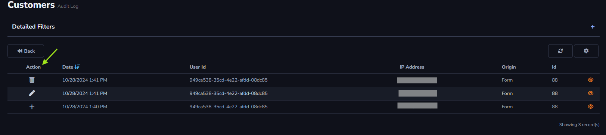
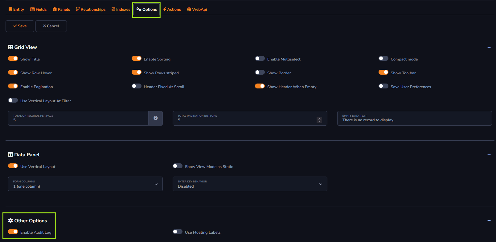

## Audit Log Action

The *Audit Log* action can be found in Actions - Grid Toolbar and Form Toolbar.

The *Log* Action will be used to store changes made to the table data. If any information is added, edited, or deleted, these actions will be shown along with the user responsible for the action in the log.

It is important to remember that the *Audit Log* action must be enabled within the *Options* tab. The image below will show how to enable this option.

General and advanced settings:

[!include[expressions](overview_action.md)]

