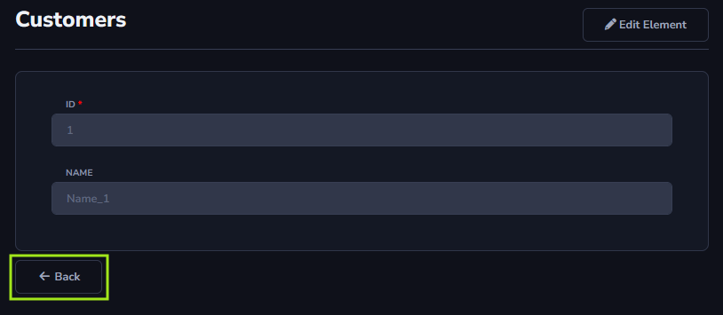

## Back Action

The *Back* action will be used to go back after viewing a form, for example, to view a registered record through the *View* action and then return to the data table.

#### About Form Toolbar

The *Back* action can only be applied to the *Form Toolbar*.

[!include[expressions](form_toolbar_overview_action.md)]

#### About General and Advanced settings

[!include[expressions](overview_action.md)]