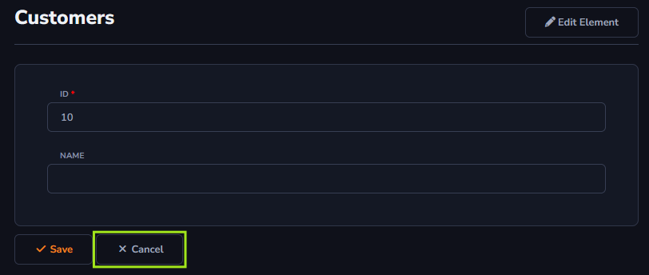

## Cancel Action

The *Cancel* action will be used to abort an edit to the table information, for example, to cancel the edit of information or the addition of a new record. This way, the new information will not be persisted in the data table.

#### About Form Toolbar

The *Cancel* action can only be applied to the *Form Toolbar*.

[!include[expressions](form_toolbar_overview_action.md)]

#### About General and Advanced settings

[!include[expressions](overview_action.md)]