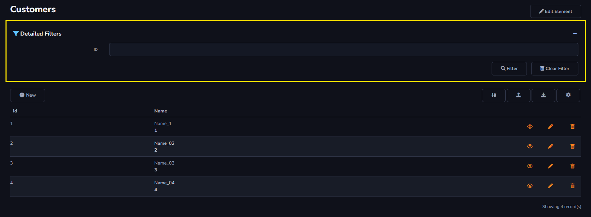
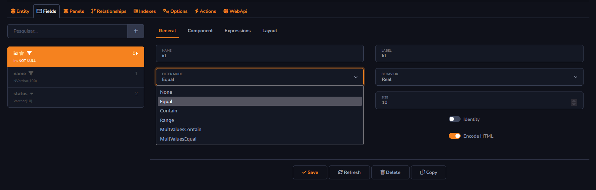

## Detailed Filters Action

The *Detailed Filters* action will be used to search for information registered in the data table.

#### Filter Action

- Show as Collapse: Allows the filter to be displayed as a collapse, making it possible to expand and minimize the page filters.

- Expanded By Default: This option defines whether the filter's Collapse Panel will be rendered expanded when accessing the page for the first time.

- Enable Client-Side Search: Allows enabling a filter unrelated to the table, where any desired keyword can be used to perform a search.

Other fields can be added to the filter. It is necessary to edit the *Filter Mode* field within *Fields* -> *General*. The *None* option will prevent the filter from being enabled for searches in your table.

#### About Grid Toolbar

The *Detailed Filter* action can only be applied to the *Grid Toolbar*.

[!include[expressions](grid_toolbar_overview_action.md)]

#### About General and Advanced settings

[!include[expressions](overview_action.md)]