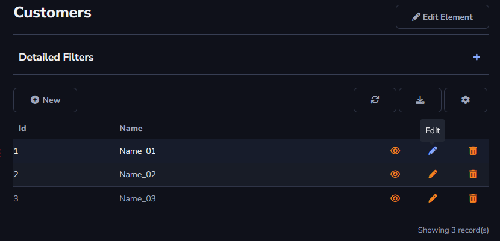
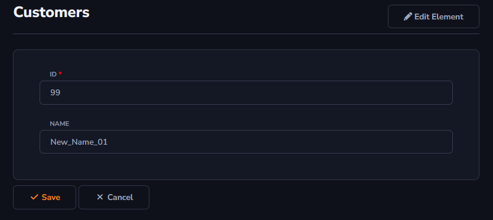

## Edit Action

This action allows changes to be made to the values of each row registered in the table.

Example - Changing the *Id* and *Name* of the registered row.

There will be an option to save your changes, or cancel the action.

When the action is applied to the *Form Toolbar*, it will only be displayed alongside the relationships.

#### About Grid and Form Toolbar

The *Edit* action can be found in Actions - Grid Toolbar and Form Toolbar.

[!include[expressions](grid_table_overview_action.md)]

[!include[expressions](form_toolbar_overview_action.md)]

#### About General and Advanced settings

[!include[expressions](overview_action.md)]

