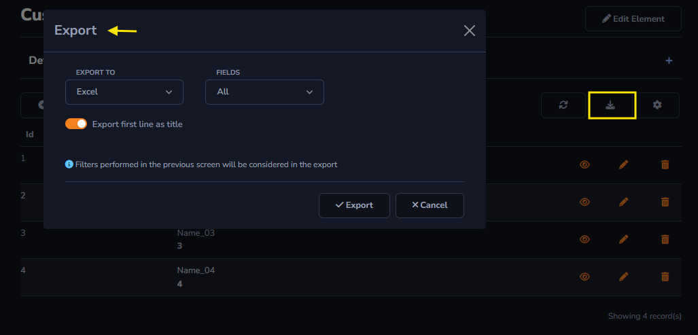

## Export Action

The *Export* action can be found in Actions - Grid Toolbar.

#### Export Action

- Sql Command before and after starting the process: SQL command can be configured to change the value of a table column, for example, setting a TRUE value for a column if the data has already been exported.

- Global Scope: Only one process from this element can be run at a time, and all users will be able to view the latest log and execution of an ongoing process. 

- Global User: Several users can run this process simultaneously, but only see the log and one run of your process.

- Download file name: Name of the file that will be downloaded by the user.

#### Export Actions on form toolbar

- Export to: It is possible to choose which document type is going to be used to export the file between *.txt*, *.pdf* and *.csv*.

- Fields: It is possible for the table to have hidden columns on grid display. In this case, the *Fields* option will allow you to choose between exporting only the columns displayed in the grid or exporting all possible columns from the table.

- Export first line as title: This option allows you to modify the export file, making it possible to export the title of each column along with the information, or just the information without the titles.

General and advanced settings:

[!include[expressions](overview_action.md)]

