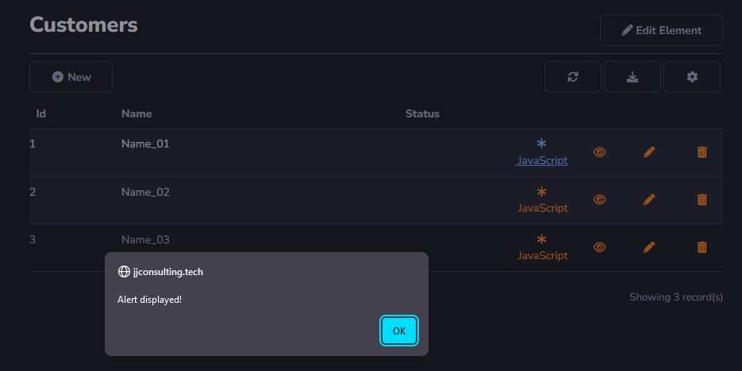

# JavaScript Script

### Script Action

It will be used to execute JavaScript in the browser.

For example, creating an alert command.

```
alert("Alert displayed")
```



<<<<<<< HEAD
[!include[expressions](overview_action.md)]
=======
[!include[expressions](overview_action.md)]


>>>>>>> main
