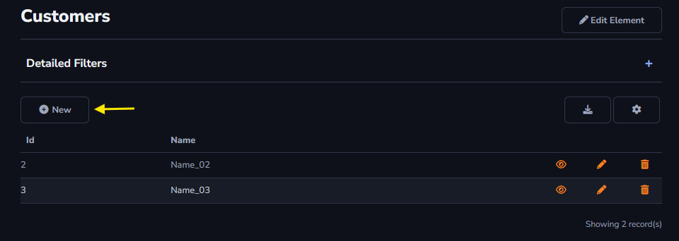
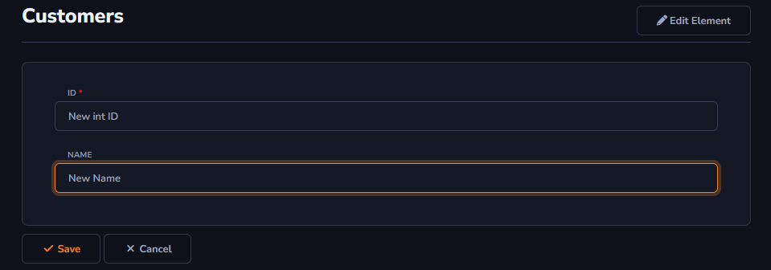
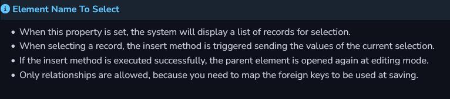

## New Action

The *New* action can be found in Actions - Grid Toolbar.

#### Grid Toolbar

A ação *New* será exibida somente na Grid Toolbar, e será utilizada para adicionar uma informação a sua Grid Table, por exemplo, adicionar um novo registro.

The values "New int ID" and "New Name" were entered by the user, and this information will be recorded in your table.

#### Insert Action

Insert Action can be accessed through the Edit button within the Grid Toolbar settings.

- Location: You can change where the form will be displayed. When it is selected to be shown above or below the grid, the form will always be open and visible. The option "Button At Grid" will keep the button above the grid, and it is necessary to click on the button to open the form.

- Element Name to select: This option will only be enabled when there is a relationship between the current table and another table. When there is a relationship, it will be possible to use an existing entry from the related table to create a new entry in the current table. The relationship can be configured through the "Relationships" tab.

- Reopen Form: The form for adding records will be reopened after saving a new record, allowing the action to be performed in sequence.

- Success Message: It will be shown when the form is reopened or when the form is next to the grid.

- Show as Modal: Allows the form to be displayed as a modal, keeping it displayed on top of the current table.

- Modal Title: Title to be displayed when the "New" action is shown as a form.

There will be also a tutorial about *Element Name to select*.

General and advanced settings:

[!include[expressions](overview_action.md)]

