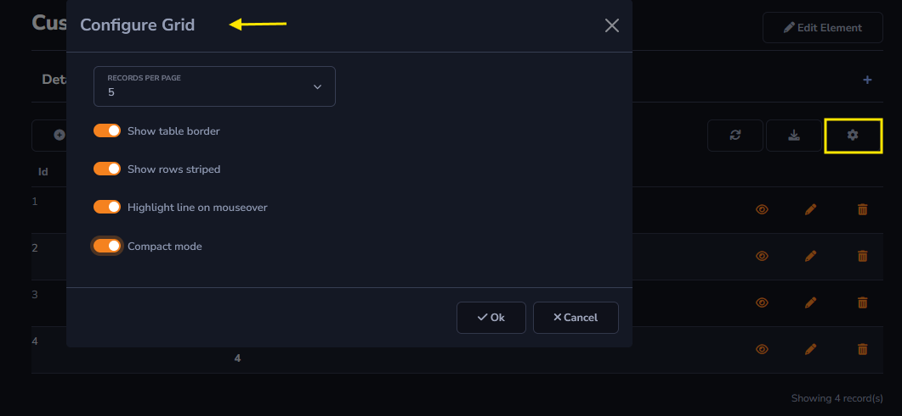

## Options Action

The *Options* action can be found in Actions - Grid Toolbar.

#### Possible changes

The *Options* action allows changes to the display details of the table.

- Records per page: Changes the number of records to be displayed on the screen.

- Show table border: When enabled, it will display the borders of each row and column within the table.

- Show rows striped: Allows alternating row colors, with one row having a light color and the next having the default background color.

- Highlight on mouseover: Highlights the row where the mouse cursor is hovering.

- Compact mode: Reduces the height of the rows, making them more compact.

The image below will show how the possible changes will be displayed in your table.

General and advanced settings:

[!include[expressions](overview_action.md)]