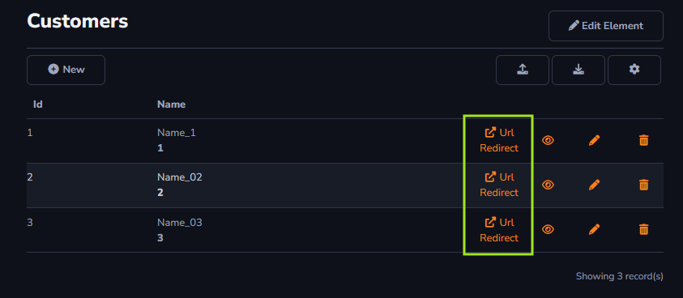

## Possible applications

#### Grid Table

The action button will be applied to the grid row, displayed next to the row's information. The button will be shown on all rows registered in the table.

#### Grid Toolbar

The action button will be applied once for the grid. It will be visible in the top-left corner.

#### Form Toolbar

The action button will be applied within the form. For example, when trying to add an item to your table, the button will be visible in the top-left corner of the form.

#### Field

The action can be applied to a form field, and the action will appear next to the field. The action can be configured in: Fields - Component - Actions.

## General

##### Name

Represents the internal identifier. This value is required and must be unique. It is typically used in the code to locate the action.

##### Icon

Allows applying the desired icon to the created action.

##### Text

The Text field will be displayed next to the button when filled.

##### Tooltip

Enables displaying a text field when hovering the cursor over the action button.

## Advanced

##### Visible and Enable Expression

The action supports expressions. For more information, visit [Expressions](../expressions.md).

##### Confirmation Message

A confirmation message will be displayed to the user before performing the desired action.

##### Css Class

Allows modifying the action button's layout. The CssClass can be defined according to the classes already existing in the project or a new Css Model can also be created to the button.

##### Color

The pre-existing CSS classes from the project will be loaded. Selecting this field will affect the display of the visible icon and text.

##### Order

The Order field allows changing the position between the available actions on the grid, such as reordering the actions *Edit*, *View*, and *Url Redirect*.

##### Show Title

This option will enable or disable the display of the action column title. The value shown will be the same as the one entered in the *Text* field in the *General* tab.

##### Show as Button

Allows switching between displaying the action as an icon or a button.

##### Is Default

This option will only apply to the grid. Any click within the grid will consider the action as *Is default*. For example, setting the *View* action as *Is default* will allow the action to be triggered by clicking anywhere on the grid row, not just on the icon.

##### Is Group

Will group all actions that have the *Is group* option selected. Actions can be grouped into a sub-menu on the grid or even in the toolbar.

##### Divider Line

Will be used as a delimiter for each item within the sub-menu described in the *Is group* section.
