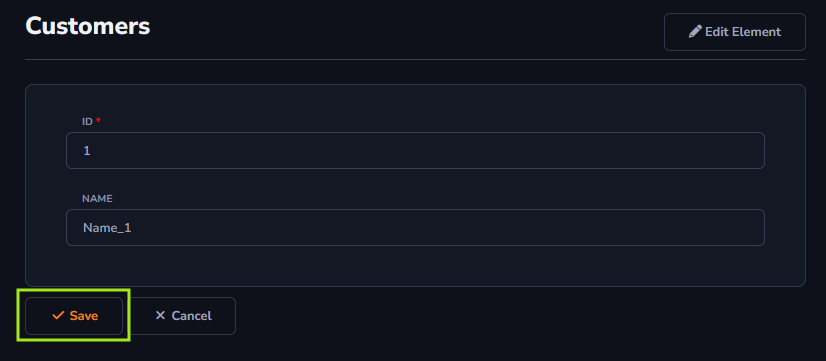

## Save Action

The *Save* action will be used to save an edit to the table information, for example, to edit or add information to your table. This action will be responsible for persisting the changes made.

#### About Form Toolbar

The *Save* action can only be applied to the *Form Toolbar*.

[!include[expressions](form_toolbar_overview_action.md)]

#### About General and Advanced settings

[!include[expressions](overview_action.md)]