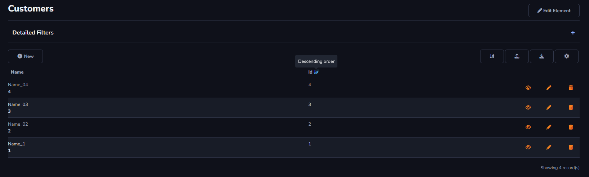
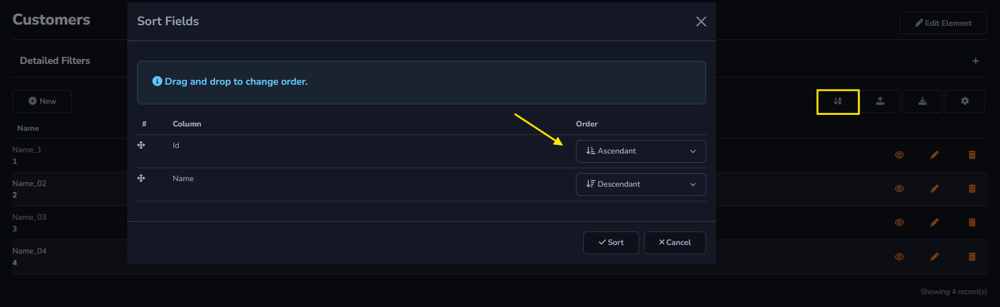

## Sort Action

The *Sort* action can be found in Actions - Grid Toolbar.

The *Sort* action allows the items in your table to be ordered in ascending and descending order. This change can be made by clicking on the desired column title.

It is also possible to modify it directly through the *Form Toolbar* icon.

General and advanced settings:

[!include[expressions](overview_action.md)]
