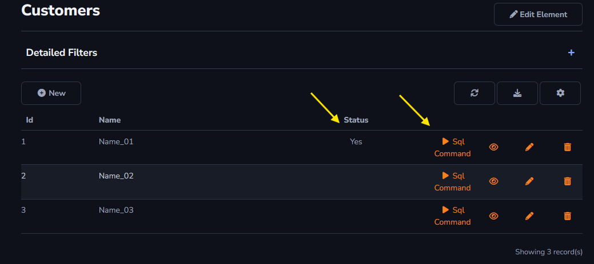

# Sql Command

### SQL Command

The action will serve to execute an SQL command on the server, for example, updating a status.

For instance, an action to change the value of the "Status" column.

```
UPDATE <tableName> SET status = 1 WHERE id = '{id}'
```

The value *STATUS = 1* is applied after the *SQL Command* button action is triggered, as shown in the image below.



### Redirect URL

After the action is executed, it redirects to the URL entered in the field.

<<<<<<< HEAD
[!include[expressions](overview_action.md)]


=======
[!include[expressions](overview_action.md)]
>>>>>>> main
