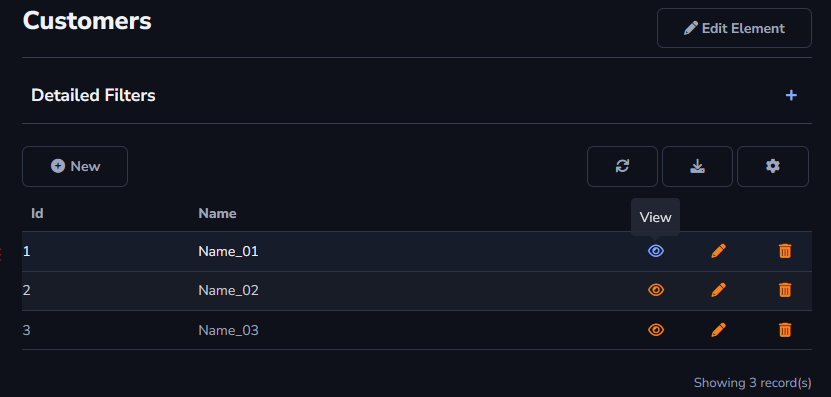
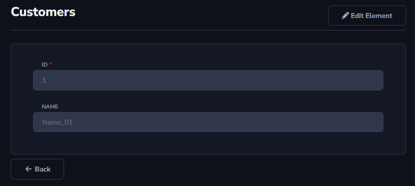

## View Action

This action allows for a detailed view of each row registered in the table. No changes can be made through this action.

The action will be applied to the grid table.

Example:

After using the *View* action:

