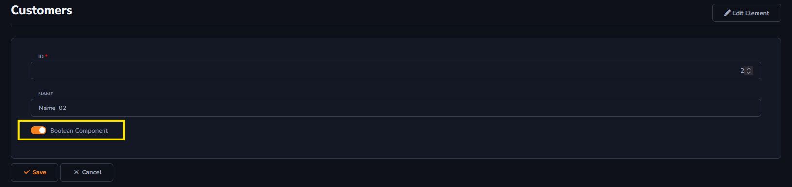

## Boolean Component

This option will be used for values in general. There will be an explanation for every option inside *Boolean Component*.

To learn how to access the *Components* field : [Overview Component ](../components/overview_component.md)

It's important to change the *Data Type* field to *Boolean*

#### Check Box

The Check Box allows the user to check or uncheck an option, indicating a true (checked) or false (unchecked) value.

#### Additional Settings

- Layout: Allows changing the appearance of the button created for *CheckBox*, *Switch*, and *Button*.