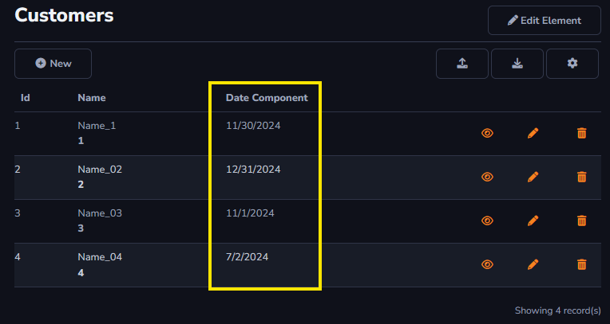
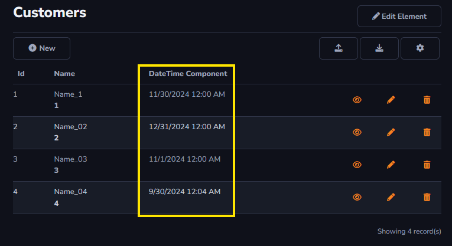
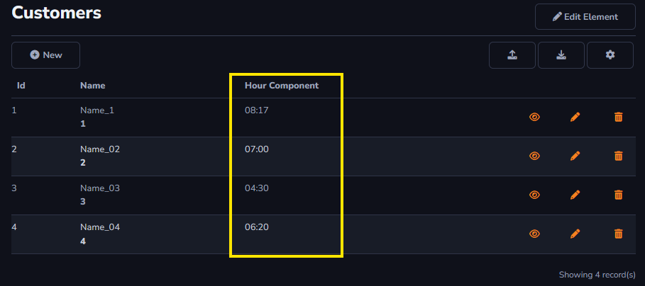

## Calendar Component

This option will be used for values in general. There will be an explanation for every option inside *Calendar Component*.

It's important to change the *Data Type* field to *Date Time*

To learn how to access the *Components* field : [Overview Component ](../components/overview_component.md)

#### Date

Allows the field to be filled with *Date* information.

The format will be MM/DD/YYYY.

#### Date Time

Allows the field to be filled with both *Date* and *Time* information.

The format will be MM/DD/YYYY HH:MM.

#### Hour

Allows the field to be filled with *Time* information.

The format will be HH:MM.

#### Additional Settings

- *AutoComplete*: Displays the current date when selecting the component on the edit screen.

