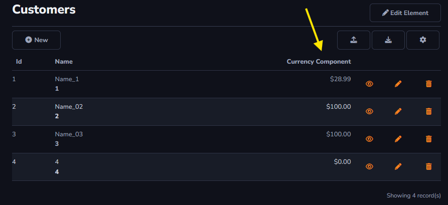
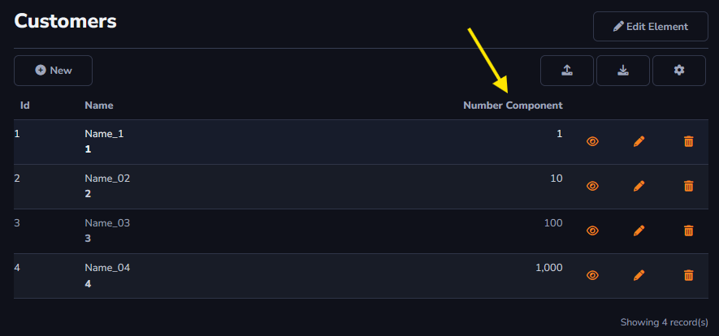
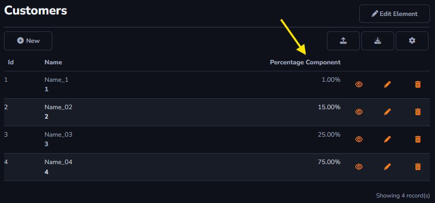
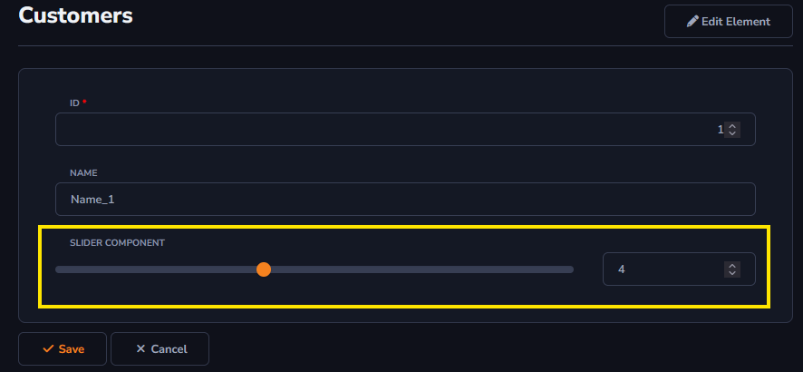

## Numeric Component

This option will be used for values in general. There will be an explanation for every option inside *Numeric Component*.

To learn how to access the *Components* field : [Overview Component ](../../components/data_dictionary/overview_component.md)

#### Currency

The *Currency* option applies a currency format to the value entered in the field.

#### Number

The *Number* option displays the value in its standard numeric format.

#### Percentage

The *Percentage* option sets a percentage format for the field's value.

#### Slider

The *Slider* option allows for the selection of a numeric value using a slider bar. The value displayed in the column will match the value in the field beside the *Slider Component*.

#### Additional Settings

- **Number of decimal places**: Sets the number of decimal places to be displayed.

- **Culture**: Applies currency formatting for the selected region.

- **Placeholder**: Shows a default message when no value is entered.

- **Minimum value**: Allows for setting a minimum value in the field.

- **Maximum value**: Allows for setting a maximum value in the field.

- **Step**: Numeric values can be entered directly or adjusted with up and down buttons. The *Step* setting defines the increment for these adjustments.