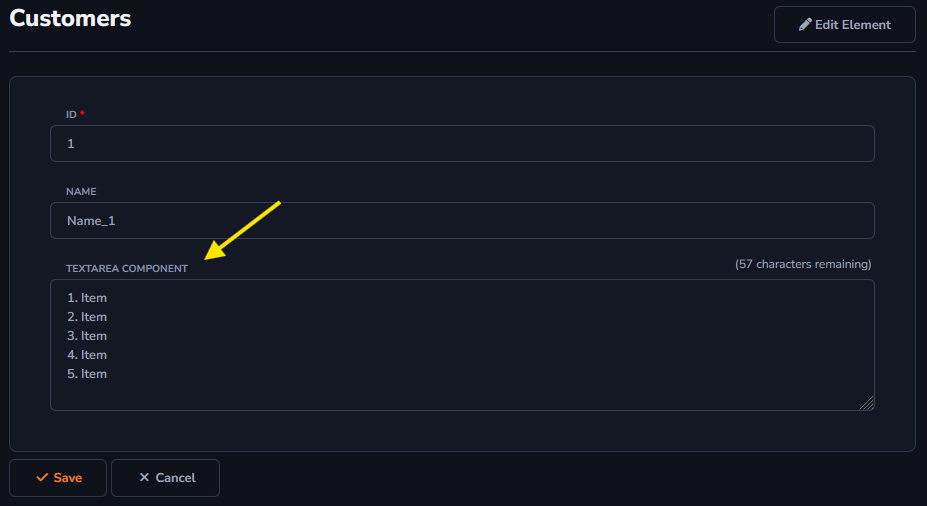
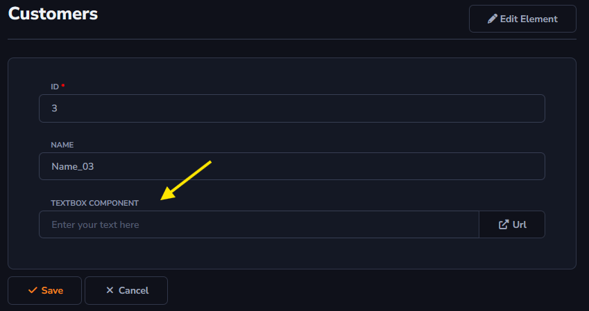

## Text Component

Text components will be used to enable a text field in the column.

To learn how to access the *Components* field : [Overview Component ](../../components/data_dictionary/overview_component.md)

#### TextArea

*TextArea* will be used to enter text information in the table column.

The *Rows* option allows you to configure the number of lines used to set the *TextArea* field size.

#### TextBox

*TextBox* will be used to enter text information in the table column.

The *Place Holder* field will be used to show predefined information if the field is still empty, for example, "Enter your email here".

Unlike the *TextArea* component, the *TextBox* option allows you to add a New Action along with the information.

