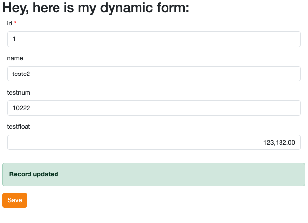

# DataPanel

JJDataPanel represents the visualization of a record in a JJMasterData Element.

## Usage

At your Controller, create a JJDataPanel instance and use the result as your Model, add it as a property to your ViewModel or use ViewData.

### At your Controller

```csharp
using JJMasterData.Commons.Data.Entity.Repository.Abstractions;
using JJMasterData.Core.DataDictionary.Models;
using JJMasterData.Core.UI.Components;
using Microsoft.AspNetCore.Mvc;

namespace JJMasterData.WebEntryPoint.Controllers;

public class DataPanelExampleController : Controller
{
    [ViewData]
    public required string PanelViewHtml { get; set; }
    
    private readonly IComponentFactory _componentFactory;
    private readonly IEntityRepository _entityRepository;

    public DataPanelExampleController(IComponentFactory componentFactory, IEntityRepository entityRepository)
    {
        _componentFactory = componentFactory;
        _entityRepository = entityRepository;
    }
    
    // GET
    public async Task<IActionResult> Index()
    {
        var dataPanel = await GetDataPanel();

        // You can remove these two lines if you are at PageState.Insert.
        int id = 1;
        await dataPanel.LoadValuesFromPkAsync(id);

        var result = await dataPanel.GetResultAsync();
        
        /// Here we intercept any async POST request, like the form reload.
        if (result is IActionResult actionResult)
            return actionResult;
        
        PanelViewHtml = result.Content;
        
        return View();

    }

    private async Task<JJDataPanel> GetDataPanel()
    {
        var dataPanel = await _componentFactory.DataPanel.CreateAsync("MyElementName");
        dataPanel.PageState = PageState.Update; // You can change here to PageState.Insert if you want.
        return dataPanel;
    }

    [HttpPost]
    public async Task<IActionResult> Save()
    {
        var dataPanel = await GetDataPanel();
        var values = await dataPanel.GetFormValuesAsync();
        var errors = dataPanel.ValidateFields(values);
        
        if (errors.Count > 0)
        {
            dataPanel.Errors = errors;
            ViewData["ReturnMessage"] = _componentFactory.Html.ValidationSummary.Create(errors).GetHtml();
        }
        else
        {
            //Update values in Database
            await _entityRepository.UpdateAsync(dataPanel.FormElement, values);
            
            var alert = _componentFactory.Html.Alert.Create();
            alert.Color = PanelColor.Success;
            alert.Title = "Record updated";
            ViewData["ReturnMessage"] = alert.GetHtml();
        }
        var result = await dataPanel.GetResultAsync();
        PanelViewHtml = result.Content;
        
        return View("Index");
    }
    
}
```

### At your View

```html
@addTagHelper *, Microsoft.AspNetCore.Mvc.TagHelpers
@addTagHelper *, JJMasterData.Web

@{
ViewBag.Title = "title";
}

<h1>Hey, here is my dynamic form:</h1>

<form asp-action="Save">

    @Html.Raw(ViewData["PanelViewHtml"])

    @Html.Raw(ViewData["ReturnMessage"])

    <button type="submit" class="btn btn-primary">Save</button>
</form>

```


