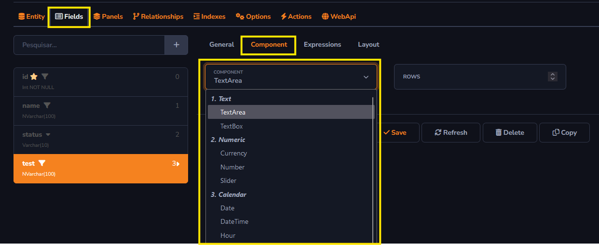

## Component

The *Component* field will be used to configure the formatting of information shown in the column.

You can access the *Component* field through the tab Fields - Component - Component.

Information can be individually configured for each column in the table.

