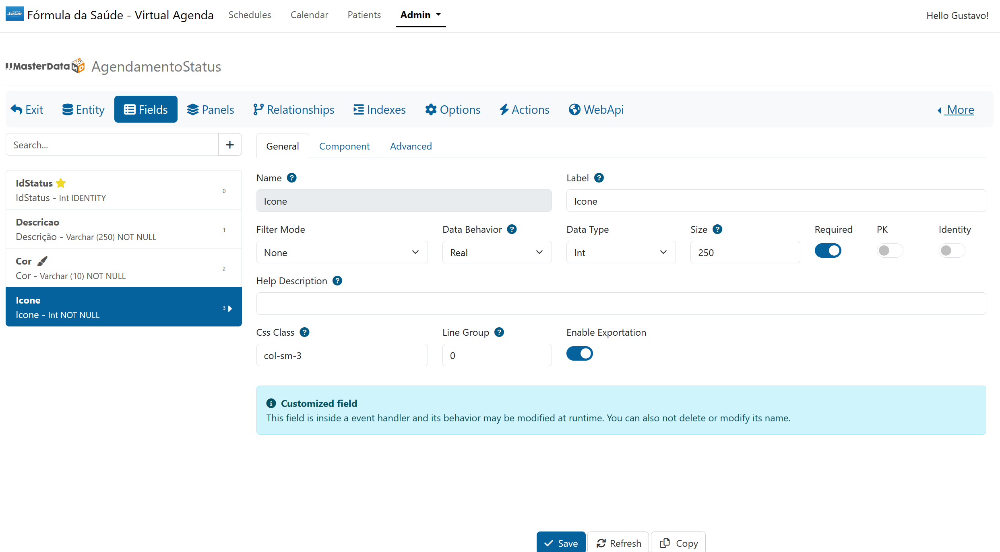

# Custom Rules

There are three ways to customize MasterData

- Event Handlers
- Editing your JJFormView at runtime
- Stored procedures

The first way is the recommended, Event Handlers don't customize the database and they reflect on systems that use JJMasterData.WebApi. They also works on any JJFormView object.

# Event Handlers

## Overview
The purpose of a class implementing <xref:JJMasterData.Core.Events.Abstractions.IFormEventHandler>, is to patronize the customizations and programmatically customize your dictionary rules without a custom view.

To customize your business rules you can use one of these:

## C# interface implementations
A .NET Form Event is a class that implements the <xref:JJMasterData.Core.Events.Abstractions.IFormEventHandler> interface.

Create a class with starts with your element name or use the `FormEvent` attribute.

Implement <xref:JJMasterData.Core.Events.Abstractions.IFormEventHandler> in your class and then generate your overrides with CTRL+. in your class using VS or Rider:


Your implementation will look like this:
```cs
public class AgendamentoStatusFormEventHandler : FormEventHandlerBase
{
    private const string IconeFieldName = "Icone";
    public override string ElementName => "AgendamentoStatus";
    
    public IEnumerable<string> GetCustomizedFields()
    {
        yield return IconeFieldName;
    }
    
    public override ValueTask OnFormElementLoadAsync(object sender, FormElementLoadEventArgs args)
    {
        var formElement = args.FormElement;
        var iconField = formElement.Fields[IconeFieldName];
        iconField.Component = FormComponent.Search;
        iconField.DataItem = new FormElementDataItem
        {
            DataItemType = DataItemType.Manual,
            Items = new List<DataItemValue>(),
            ShowIcon = true
        };

        foreach (var icon in Enum.GetValues<IconType>())
        {
            iconField.DataItem.Items.Add(new DataItemValue
            {
                Id = ((int)icon).ToString(),
                Description = icon.ToString(),
                Icon = icon
            });
        }
        
        return ValueTask.CompletedTask;
    }
}
```


> [!TIP] 
> If you add the <xref:JJMasterData.Core.Events.Attributes.CustomizedFieldsAttribute> at your class, your customized fields will look like the image below.

<br>


> [!TIP] 
> If you want to also customize Grid events, you can also implement <xref:JJMasterData.Core.UI.Events.Abstractions.IGridEventHandler> at your class.


## Python event handler implementations
You can check out our [Plugin](plugins/python.md)

## IFormEventResolver

<xref:JJMasterData.Core.Events.Abstractions.IFormEventHandlerResolver> is the responsible for retrieving <xref:JJMasterData.Core.Events.Abstractions.IFormEventHandler> implementations from a element name.
You can also create your own implementation.
At your Program.cs use:
```cs
builder.Services.AddJJMasterDataWeb().WithFormEventResolver<TYourImplementation>();
```

## Dynamically loading Event Handlers using DI

<br>

If you want to dynamically load from another assembly for example, you can use the following example:
```cs
Assembly assemblyWithEvents = typeof(MyFormEventHandler).Assembly;
Assembly anotherAssembly = typeof(MyFormEventHandler).Assembly;

builder.Services.AddEventHandlers<IFormEventHandler>(assemblyWithEvents, anotherAssembly);

```

# Customizing your FormView

```cs
var formView = await FormViewFactory.CreateAsync("ElementName");
formView.FormElement.Title = "Runtime customization".
```

> [!WARNING]
> These changes will only reflect at this specific instance.


# Customizing with stored procedures

In your stored procedure (defined at your Data Dictionary) you can throw a custom exception with a code `>` than 50000.

```


```sql
IF (MyCustomLogic, you can use your @Parameters)
  THROW 50001, 'My custom validation rule', 1
```

> [!WARNING] 
> It is not a best practice write business rules at database, recommended only for simple validations.

---

