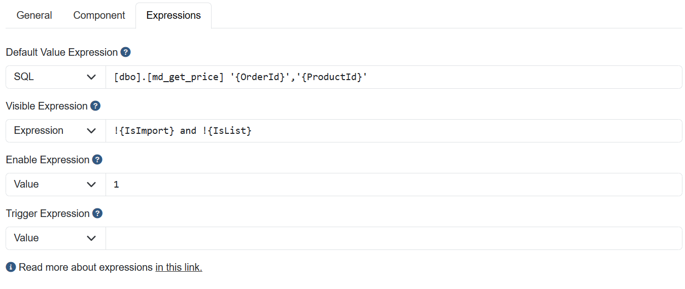

<h1>Expressions<small> Any fields and actions supports expressions</small></h1>

## What is a expression?
Expression is a simple way to return a dynamic value from a string.

## How it works?

Expressions can return a boolean or a object value at runtime<br>
Example: <br>

"val:1" Return true.
<br>
"val:0" Return false.
<br>
"exp:1=1" Return true.
<br>
"exp: {IsList}" If at the list state return true<br>
"exp:'{pagestate}' = 'UPDATE' AND '{ID}' = '1'" If update and a field value ID equals 1 return true<br>

**Don't forget to add single quotes, if your value is a string or can be null, because it will be replaced at runtime** 

In the Data Dictionary UI, the expression editor is simplified like this:



## What are the default expression providers?
- Type [val:] returns a value; (1 or 0) (true or false) ("foo") etc..
- Type [exp:] returns the result of the expression from `DataTable.Compute`;
- Type [sql:] returns the result of a sql command;

> [!TIP] 
> Check if your field supports all expressions checking the attributes of the desired property at the docs.

> [!TIP]
> SQL Expression values will be replaced with a SQL variable to prevent SQL injection attacks.

## How to do it?
Building an expression<br>
> [!WARNING] 
> Contents enclosed in {} (braces) will be replaced by current values at runtime. Following the order:


**MasterData keywords**<br>
- {PageState} = "INSERT" | "UPDATE" | "VIEW" | "LIST" | "FILTER" | "IMPORT"
- {IsList} = 1 | 0
- {IsFilter} = 1 | 0
- {IsView} = 1 | 0
- {IsInsert} = 1 | 0
- {IsUpdate} = 1 | 0
- {IsDelete} = 1 | 0
- {IsImport} = 1 | 0
- {ComponentName} = Name of the component that triggered the AutoPostBack event
- {UserId} = Identifier of the authenticated user, can be recovered from UserValues, Session or Claims

Dynamic values will be recovered in the following order:
1. MasterData keywords
2. UserValues
3. FormValues
4. UserSession
5. Claims

## Examples

Example using [val:] + text<br>
1. val:a simple text;
2. val:10000;
```cs
var field = new ElementField();
field.DefaultValue = "val:test";
```

Example using [exp:] + expression<br>
1. exp:'{field1}';
2. exp:({field1} + 10) * {field2};
```cs
var field = new ElementField();
field.DefaultValue = "exp:{UserId}";
```

Example using [sql:] + query<br>
1. sql:select 'foo';
2. sql:select count(*) from table1;
```cs
var field = new ElementField();
//In the runtime this will be replaced with select field2 from table1 where field1 = @field1
field.DefaultValue = "sql:select field2 from table1 where field1 = '{field1}'";
```

## Types of Expressions
- Default Value: When the value is null or empty, this expression will execute before the trigger to populate the value
- Trigger Expression: This is always executed after an AJAX request to reload the form or when the form is first opened.
- Visible Expression: Controls the field visibility, and must return a bool value.
- Enable Expression: Controls if the field is enabled or not, if the field is disabled, the value is not sent to the server, and must return a bool value.

## Implementing your own expression provider

You can implement both <xref:JJMasterData.Core.DataManager.Expressions.Abstractions.IBooleanExpressionProvider> (used at visible and enable expressions) or <xref:JJMasterData.Core.DataManager.Expressions.Abstractions.IAsyncExpressionProvider> (used at triggers and default values.).

You can call <xref:JJMasterData.Core.DataManager.Expressions.ExpressionHelper> to replace values {} with runtime values.

At your `Program.cs` simply:

```cs
builder.Services.AddJJMasterDataWeb().WithExpressionProvider<TMyCustomProvider>();
```

[!include[Readme](../../../src/Plugins/NCalc/README.MD)]