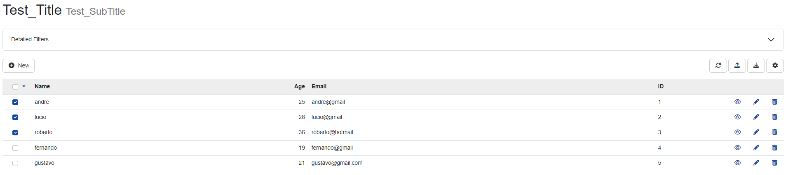
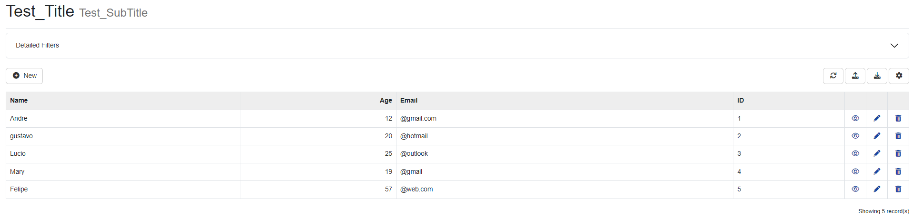
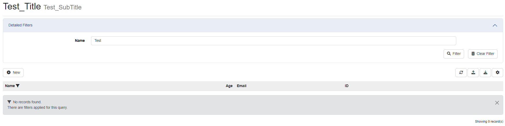
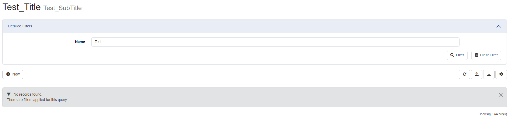
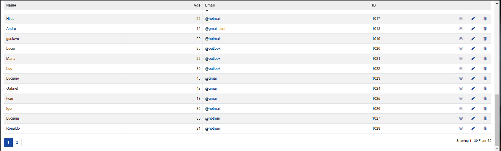
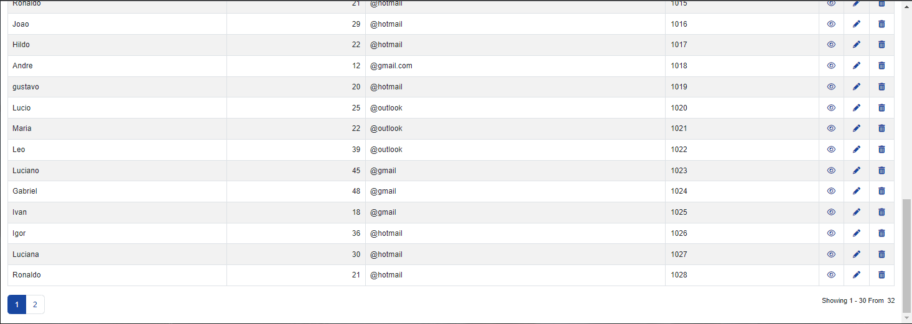
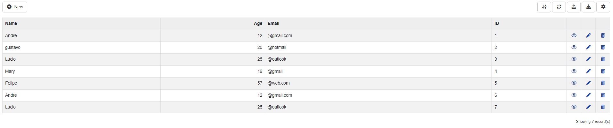
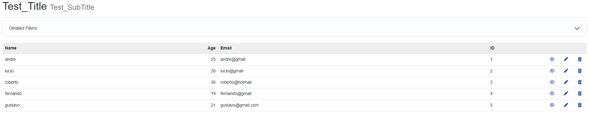

### **ShowTitle**
Enabling this setting will allow the display of the populated title and subtitle within the Entity tab.

### **Enable MultiSelect**
In this option you will need to select a Primary key to use it.

### **ShowRowStriped**
When activating this option, the grid of your table will be displayed in a zebra shape.

### **ShowPagging**
Within the settings for your table, will enable the option to change the amount of items to be displayed.

### **ShowHeaderWhenEmpty**
Defines whether the header will be displayed when there is no response from any item within the table.

### **Header Fixed**
When displaying multiple items from your table, you can keep their titles fixed as you scroll down the page.

### **MaintainValuesOnLoad**
This option will ensure that your search through the filter is saved when reloading the page, whether searching for filters or configuration options.

### **ShowBorder**
This setting will be used to display the boundary around the items present in the table.

### **EnableSorting**
This setting will allow your table items to be sorted in ascending or descending order.

### **ShowToolbar**
Enabling the ShowToolbar setting will enable the options menu at the top of your table. 
Items to be added or removed can be viewed within the Action tab and then Toolbar.

