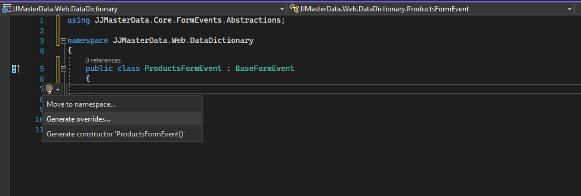
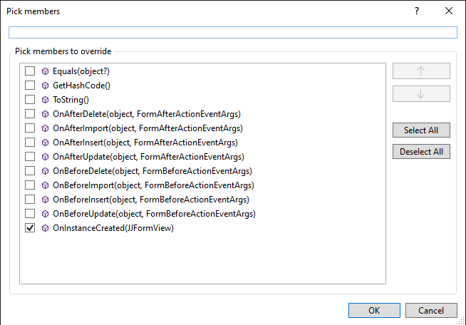

# Customize Rules

The main way to customize is using the FormEvents class to define by the IFormEvent interface. These can be Python scripts or .NET assemblies.

## Overview
The purpose of a class implementing IFormEvent, is to padronize the customizations and programmaticaly customize your dictionary rules without a custom View.
<br>

Program.cs file
```cs
builder.Services.AddJJMasterDataWeb().WithFormEvents();
```

If the class it is not in the current assembly you must pass the assembly path on startup.
```cs
Assembly assemblyWithEvents = typeof(ProductsFormEvent).Assembly;
builder.Services.AddJJMasterDataWeb().WithFormEvents(assemblyWithEvents);
```

or

If you are using .NET Framework and want to display your assemblies in a external Data Dictionary website, add to the external site Web.Config, the following key:
If for some specific reason are with this scenario in .NET 6, set this key using JJMasterDataSettings.

```xml
	<add key="JJMasterData.ExternalAssemblies" value="C:\\FullPathToTheMainApplicationAssembly" />
```

> [!TIP] 
> To use them, just add WithFormEvents() method on AddJJMasterDataWeb(). It will automatically add any class implementing IFormEvent to the services container.

To customize bussiness rules on form follow theses steps:

## Customizing with C# 
A .NET Form Event is a that inherits from BaseFormEvent which consequently implements the IFormEvent interface. 
By creating such a class it is possible to execute code in all events defined by the interface.

Create a class with starts with the Data Dictionary name and inherits it from [BaseFormEvent.](../lib/JJMasterData.Core.FormEvents.Abstractions.BaseFormEvent.html) <br>

Press "CTRL + ." on Visual Studio and click in Generate overrides...


Then choose the events to customize


It's look like with this

```cs
using JJMasterData.Core.FormEvents.Abstractions;
using JJMasterData.Core.WebComponents;

namespace JJMasterData.Web.DataDictionary
{
    public class ProductsFormEvent : BaseFormEvent
    {
        public override void OnInstanceCreated(JJFormView sender)
        {
            sender.FormElement.Title = "My Custom title";
        }
    }
}
```

## Customizing with Python

Create a python file with your data dictionary name and implement a class with the same name. Add jjmasterdata.py to enable autocomplete features.
To deploy, paste the file on the bin folder of your site or specify the path on the services setup.
```py
from JJMasterData.Core.FormEvents.Abstractions import BaseFormEvent

class DataDictionaryName(BaseFormEvent):
	def OnInstanceCreated(self, sender):
		sender.FormElement.Title = "Hello from Python!"
```

## How to inject them?

Install JJMasterData.Python and them simply inject in your application startup with the following code:

```csharp
	services.AddJJMasterDataWeb().WithPythonEngine()
```

## Customizing with Database procedure 

In the MSSQL procedure you can throw a custom exception with error id > 50000. 

```sql
IF (1=1)
  THROW 50001, 'My Custom error message', 1
```

> [!WARNING] 
> It is not a best practice, recommended only for simple validations.


