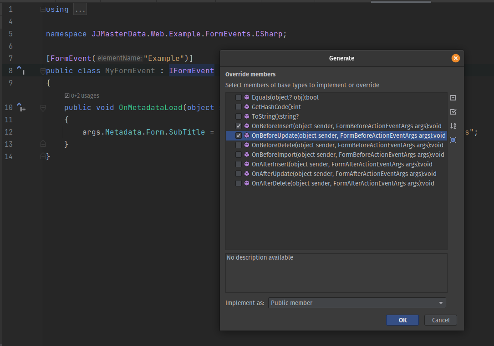

# Customize Rules

There are three ways to customize MasterData

- FormEvents
- Editing your JJFormView at runtime
- Stored procedures

The first way is the recommended, FormEvents don't customize the database and they reflect on systems that use JJMasterData.WebApi. They also works on any JJFormView object.

# FormEvents

## Overview
The purpose of a class implementing <xref:JJMasterData.Core.FormEvents.Abstractions.IFormEvent>, is to patronize the customizations and programmatically customize your dictionary rules without a custom view.

<br>

To use them add to your `Program.cs` file the following method:

```cs
builder.Services.AddJJMasterDataWeb().WithFormEventResolver();
```

If the class it is not in the current assembly you must pass the assembly path on startup.

```cs
Assembly assemblyWithEvents = typeof(MyFormEvent).Assembly;
builder.Services.AddJJMasterDataWeb().WithFormEventResolver(options=>
{
    options.Assemblies = assemblyWithEvents;
});
```

To customize your business rules you can use one of these:

## Assembly reflection (Default implementation)
A .NET Form Event is a class that implements the <xref:JJMasterData.Core.FormEvents.Abstractions.IFormEvent> interface.

Create a class with starts with your metadata name or use the `FormEvent` attribute.

Inherit from BaseFormEvent (that implements IFormEvent) in your class and then generate your overrides with CTRL+. in your class using VS or Rider:



Your implementation will look like this:
```cs
[FormEvent("Example")] // or a class that starts with your element name.
public class MyFormEvent : BaseFormEvent
{
    public override void OnMetadataLoad(object sender, MetadataLoadEventArgs args)
    {
        args.Metadata.Form.SubTitle = "You can edit your metadata at runtime using the FormEvent class";
    }
}
```

## Python
Check our [Plugin](plugins/python.md)

## IFormEventResolver

Implement your own <xref:JJMasterData.Core.FormEvents.Abstractions.IFormEventResolver> 
that returns a <xref:JJMasterData.Core.FormEvents.Abstractions.IFormEvent> from a dictionary name.

At your Program.cs use:
```cs
builder.Services.AddJJMasterDataWeb().WithFormEventResolver<TYourImplementation>();
```

# Customizing your FormView

At your custom view:

```html
@{

    void Configure(JJFormView formView)
    {
        formView.FormElement.SubTitle = "You can edit any property from JJFormView at runtime";
    }
}
<form>
    <jj-form-view element-name="Example" configure="Configure"/>
</form>

```

> [!WARNING]
> These changes will only reflect at this view

# Customizing with stored procedures

In your stored procedure (defined at your Data Dictionary) you can throw a custom exception with a code `>` than 50000. 

```sql
IF (MyCustomLogic, you can use your @Parameters)
  THROW 50001, 'My custom validation rule', 1
```

> [!WARNING] 
> It is not a best practice write business rules at database, recommended only for simple validations.

---

