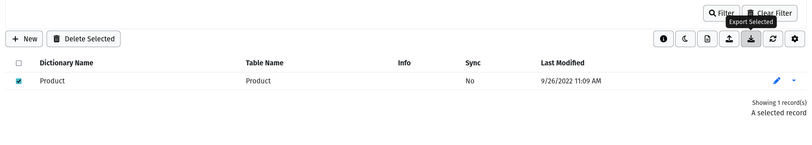
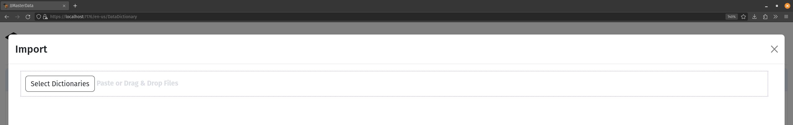

# Exporting and Importing Data Dictionaries

Exporting and importing dictionaries is a way to version control them or to share dictionaries between systems.

## Exporting

To export your dictionaries, select the ones you want with the checkbox and select the option "Export Selected". A .zip file with all the dictionaries will be downloaded.

## Importing

To import your dictionaries, select the option "Import" and upload multiple .json files containing JJMasterData data dictionaries.