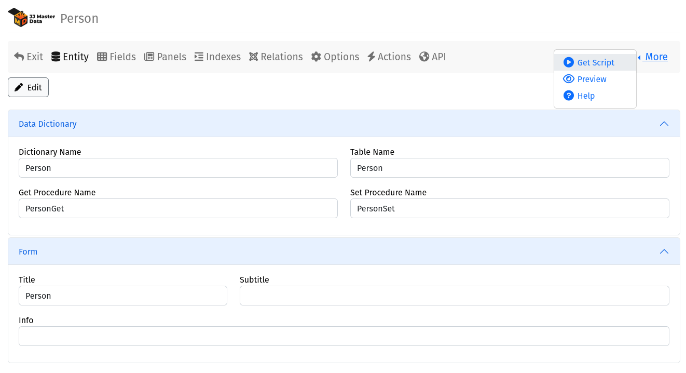

# Getting Started

This tutorial assumes you will use .NET 6+, for .NET Framework 4.8 support,
check our [documentation](miscellaneous/netframework.md).

## 1. Install JJMasterData.Web from NuGet


Installing JJMasterData.Web, will install all required dependencies.

## 2. Add a SQL Server ConnectionString to your configuration file
In your configuration file (normally appsettings.json), add a SQL Server connection string. 

```json
{
  "AllowedHosts": "*",
  "ConnectionStrings": {
    "ConnectionString": "data source=localhost,1433;initial catalog=JJMasterData;Integrated Security=True"
  },
  "ConnectionProviders": {
    "ConnectionString": "System.Data.SqlClient"
  }
}
```
Support for more DBMSs is planned. 
For more information see [configurations](configurations.md).

## 3. Modify Program.cs
Add the following lines to your Program.cs
```csharp
//This line will add JJMasterData required services.
builder.Services.AddJJMasterDataWeb();

//Add this line before specifing your default route. It will use the required services and add the RCL routes.
app.UseJJMasterDataWeb();
```

## 4. Navigate on Data Dictionary
Next, run your website and open in your browser the route:
```
/en-us/DataDictionary,
```
you will be presented with the following screen:


## 5. Create your first Data Dictionary
Click in `New` Data Dictionary button, enter the table name (Person), after that, you will have a representation of your metadata.



In `Fields` menu Add 3 fields:
 - **Id** Int (Not Null) PK
 - **FirstName** nvarchar 50 (Not Null)
 - **Age** int

Click on menu "More/Get Scripts" and then "Run All"<br>
The table and procedure will be created in the database.


After running the database Scripts, click on Preview, 
and you will have your CRUD with nearly zero code:


For more information see about [Data Dictionary](tutorials/creating_data_dictionary.md).

## Ok, really cool! But how to use these CRUDs on my application?
JJFormView is the class responsible to render all JJMasterData CRUDs. It have many features out of the box like filters, data exportation and
a huge customization potential using .NET code, you can even inject Python code in your application at runtime.
You have 2 options to instantiate a JJFormView:

1. Using the `/DataDictionary/Render/{dictionaryName}` route
2. Creating a View or Page instantiating a JJFormView

For customization you have a lot of scenarios too:
1. Using the DataDictionary Web interface, we have lots of options, we don't have everything documented **yet**, but you can help submitting a PR
2. Using the IFormEvent interface (recommended), check the docs for more information
3. Customizing your own JJFormView object at your pages (the old school way of the JJ Consulting team in the WebForms era, not recommended)