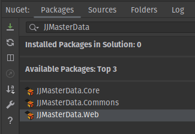
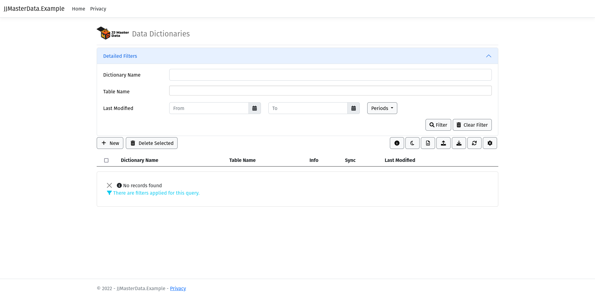
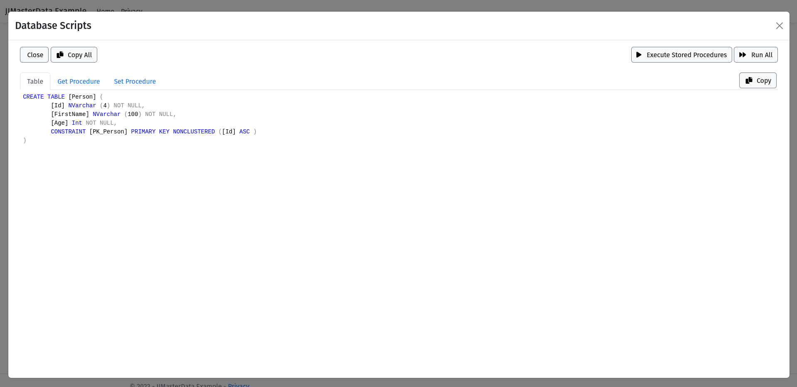
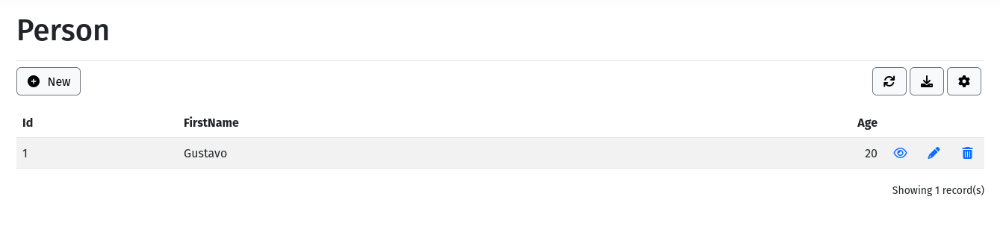

# Getting Started

This tutorial assumes you will use .NET 6+, for .NET Framework 4.8 support,
check our [documentation](miscellaneous/netframework.md).

## 1. Install JJMasterData.Web from NuGet


Installing JJMasterData.Web, will install all required dependencies.

## 2. Add a SQL Server ConnectionString to your configuration file
In your configuration file (normally appsettings.json), add a SQL Server connection string. Support for more DBMSs is planned. For more information see [configurations](configurations.md).

## 3. Modify Program.cs
Add the following lines to your Program.cs
```csharp
//This line will add JJMasterData required services.
builder.Services.AddJJMasterDataWeb();

//Add this line before specifing your default route. It will use the required services and add the RCL routes.
app.UseJJMasterDataWeb();
```

Add the following lines to your _Layout.cshtml <head>
```html
<partial name="_MasterDataStylesheets"/>
<partial name="_MasterDataScripts"/>
<partial name="_MasterDataTheme"/>
```
**IMPORTANT**: If you have Bootstrap and jQuery installed, remove it from your _Layout.cshtml both CSS and JS,
JJMasterData already have Bootstrap and jQuery installed. You can choose Bootstrap 3, 4 and 5 using [JJMasterDataSettings](../lib/JJMasterData.Commons.Settings.JJMasterDataSettings.html).
If you really want to use your own Bootstrap or jQuery files or CDNs, check _MasterDataStylesheets and _MasterDataScripts source code and specify all dependencies except Bootstrap.

## 4. Create your first Data Dictionary
In your preferred database-tool like Azure Data Studio or SSMS, create the following example table:
```sql
-- Create a new table called '[Person]' in schema '[dbo]'
-- Drop the table if it already exists
IF OBJECT_ID('[dbo].[Person]', 'U') IS NOT NULL
DROP TABLE [dbo].[Person]
    GO
-- Create the table in the specified schema
CREATE TABLE [dbo].[Person]
(
    [Id] INT NOT NULL PRIMARY KEY IDENTITY,
    [FirstName] NVARCHAR(50) NOT NULL,
    [Age] INT NOT NULL
    -- Specify more columns here
    );
GO
```
Next, run your website and open in your browser the route /en-us/DataDictionary,
you will be presented with the following screen:


After clicking on "Next", click on "Add"



Enter the table name (Person), checking the option "Import Fields", after that, you will have a representation of your metadata.


Click on "Get Scripts" and then "Run Stored Procedures"



After running the Stored Procedures Scripts, click on Preview, and you will have your CRUD with nearly zero code 🪄



<br>

## Ok, really cool! But how to use these CRUDs on my application?
JJFormView is the class responsible to render all JJMasterData CRUDs. It have many features out of the box like filters, data exportation and
a huge customization potential using .NET code, you can even inject Python code in your application at runtime.
You have 2 options to instantiate a JJFormView:

1. Using the /DataDictionary/Render/{dictionaryName} route
2. Creating a View or Page instantiating a JJFormView

For customization you have a lot of scenarios too:
1. Using the DataDictionary Web interface, we have lots of options, we don't have everything documented **yet**, but you can help submitting a PR
2. Using the IFormEvent interface (recommended), check the docs for more information
3. Customizing your own JJFormView object at your pages (the old school way of the JJ Consulting team in the WebForms era, not recommended)