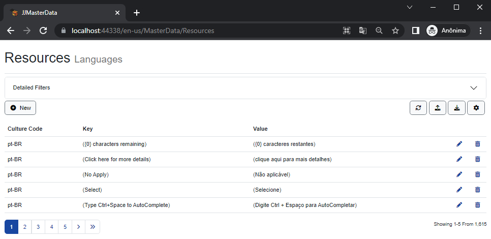

<h1>Internationalization<small> i18n</small></h1>


First you will need to add the following line to your Program.cs, with cultures you will be using:
```cs
builder.Services.AddJJMasterDataWeb();
builder.Services.AddUrlRequestCultureProvider(
    new CultureInfo("zh-CN"),
    new CultureInfo("en-US")
);
```
Now we have 3 scenarios to accomplish this:

## Resource File
Fork JJMasterData, add a resource file for your language like [this one](https://github.com/JJConsulting/JJMasterData/blob/main/src/JJMasterData.Commons/Language/JJMasterData.Resources.pt-BR.resx), and send us a pull request. Other people from your country will have the values already out of the box.

## Database
Go to ```/en-us/MasterData/Resources``` and populate the strings with your culture values, but only your system will reflect these changes


<br>

> [!TIP] 
> By default we write the resources in a table, allowed the user create dictionaries dynamically by adding translated words and texts, you can set the table name with the TableResources property in the JJMasterDataOptions class.

## Create your own localization provider
You can change the behavior of system internationalization with the interface [ILocalizationProvider](https://portal.jjconsulting.tech/jjdoc/lib/JJMasterData.Commons.Language.ILocalizationProvider.html) with your custom logic.

```cs
builder.Services.WithLocalizationProvider()
```