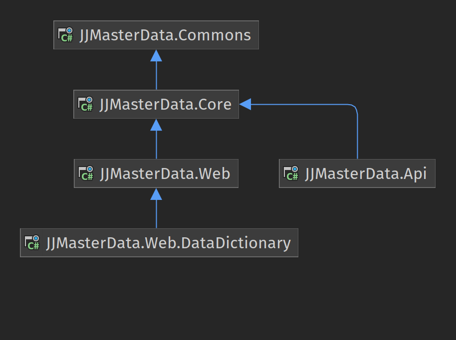

# Dependencies

JJMasterData dependencies can be represented by the following diagram:

## Assemblies

### JJMasterData.Web.Bootstraper 
Target: .NET 6
 
Website to use the Razor Class Library during development.
### JJMasterData.Web 
Target: .NET 6 
 
DataDictionary Razor Class Library.
### JJMasterData.Api
Target: .NET 6
 
RESTful API to access the DataDictionary.

### JJMasterData.Core
Targets: .NET 6, .NET Standard 2.0 and .NET Framework 4.8
 
Class library with the components to render the data in HTML.

### JJMasterData.Commons
Target: .NET Standard 2.0
 
Class library with utilities to all assemblies, like database access, l10n, logging and utils.