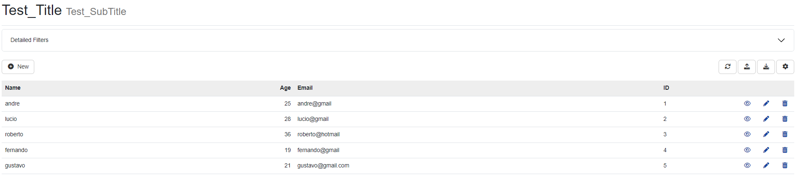
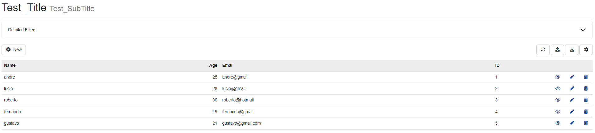
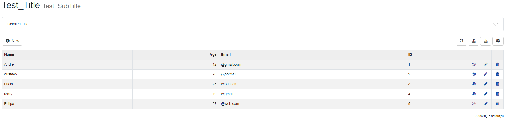
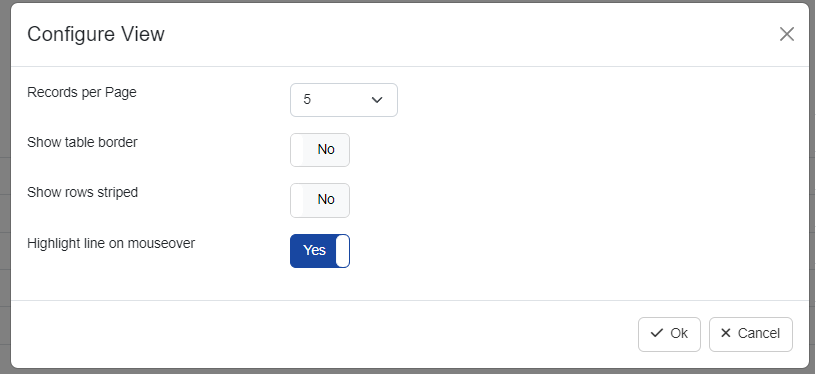
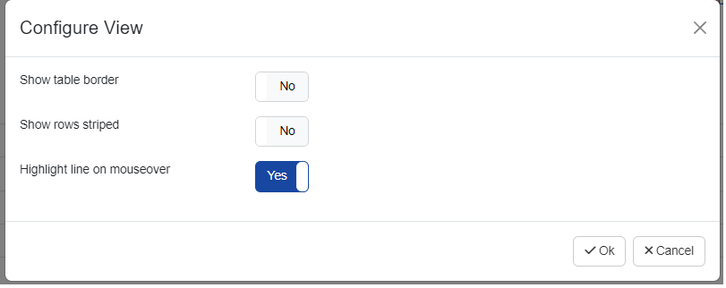
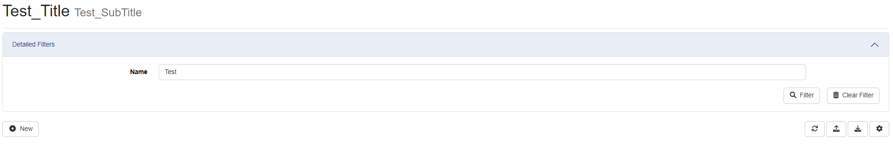
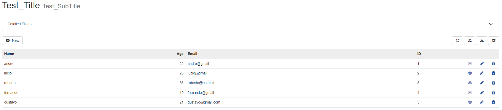
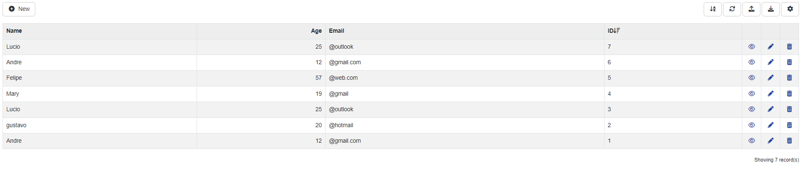
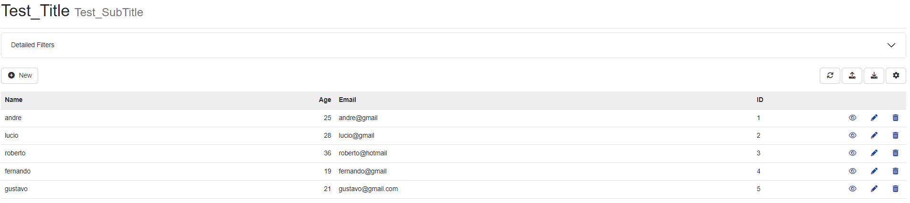

# Options

## **ShowTitle:** Show title in page header
A ativação dessa configuração permitirá a exibição do título e subtítulo preenchidos dentro da aba Entity

## **Enable MultiSelect:**
Nesta opção será necessário que você selecione uma Chave primária para utiliza-lo.

## **ShowRowStriped:**
Ao ativar está opção, a grid da sua tabela será exibida de forma zebrada.

## **ShowPagging:**
Dentro das configurações para sua tabela, Irá habilitar a opção para mudar a quantidade de itens a serem exibidos.

## **ShowHeaderWhenEmpty:**
Define se será exibido o cabeçalho quando não há resposta de nenhum item dentro da tabela

## **Header Fixed:**
Irá manter o cabeçalho fixo ao visualizar os itens mais abaixos

Verificar e publicar

## **EnableAjax:**

//

## **MaintainValuesOnLoad:**
Essa opção irá garantir que a sua busca através do filtro seja salva ao recarregar a página, sendo busca de filtros ou opções de configurações.

## **ShowBorder:**
Está configuração será utilizada para  exibir a delimitação em volta dos itens presentes na tabela.

## **EnableSorting:**
Está configuração irá permitir que os itens da sua tabela sejam ordenados de crescente ou descrecente.

## **ShowToolbar:**
A ativação da configuração de ShowToolbar irá habilitar o menu de opções na parte superior da sua tabela. Os itens a serem adicionados ou removidos podem ser visualizados dentro de aba *Action* e em seguida *Toolbar*

