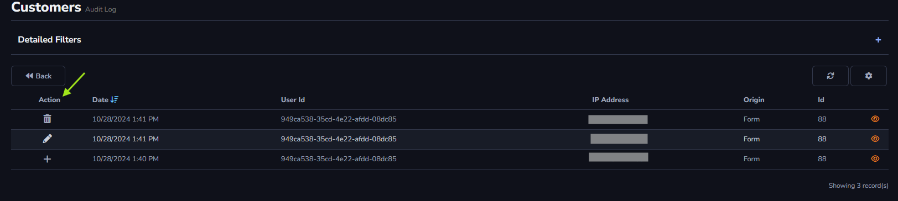
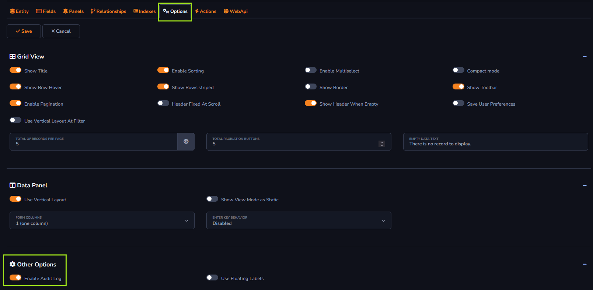

## Audit Log Action

The *Log* Action will be used to store changes made to the table data. If any information is added, edited, or deleted, these actions will be shown along with the user responsible for the action in the log.

It is important to remember that the *Audit Log* action must be enabled within the *Options* tab. The image below will show how to enable this option.

#### About Grid Toolbar

The *Audit Log* action can only be applied to the *Grid Toolbar*.

[!include[expressions](grid_toolbar_overview_action.md)]

#### About General and Advanced settings

[!include[expressions](overview_action.md)]