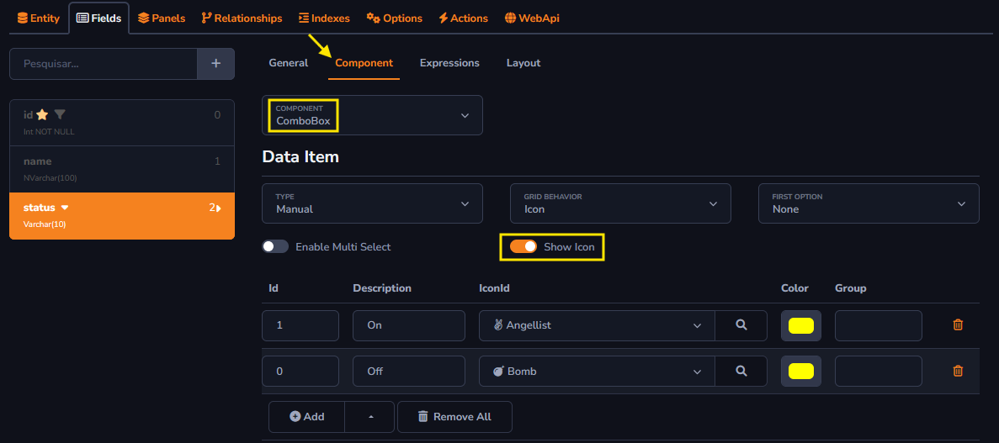
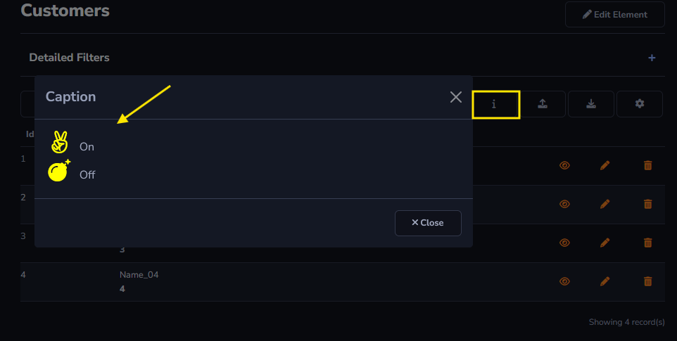

## Caption Action

The *Caption* function will be used to add a caption to your table. For example, if a user table has a column with their respective statuses, it will be possible to add a description for each status.

It is important that the status record component is marked as ComboBox so that the *Show Icon* option can be enabled and the desired options can be registered. The image below will show the expected configuration.

The *Caption* action will be displayed as follows:

#### About Grid Toolbar

The *Caption* action can only be applied to the *Grid Toolbar*.

[!include[expressions](grid_toolbar_overview_action.md)]

#### About General and Advanced settings

[!include[expressions](overview_action.md)]