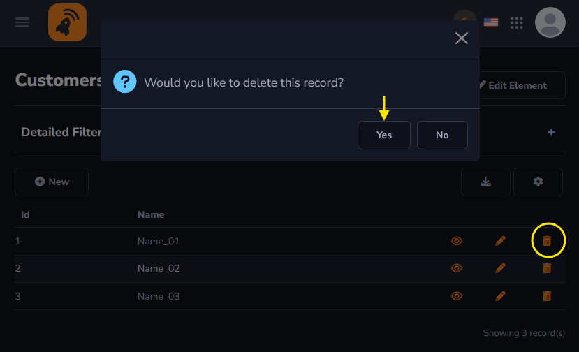
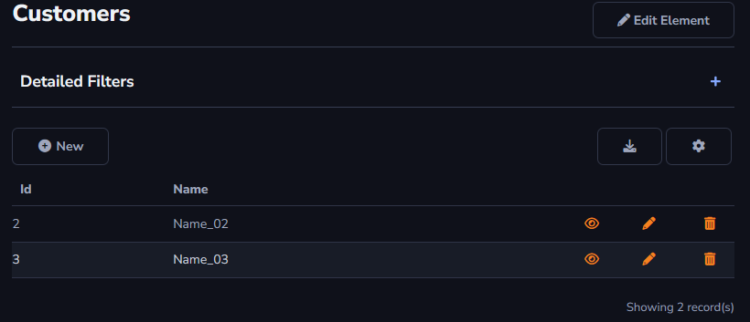

## Delete Action

This action can delete the desired data from your table.

The action will be applied to the grid table.

The selected data will be deleted after the action is performed.

#### About Grid Table

The *Delete* action can only be applied to the *Grid Table*.

[!include[expressions](grid_table_overview_action.md)]

#### About General and Advanced settings

[!include[expressions](overview_action.md)]

