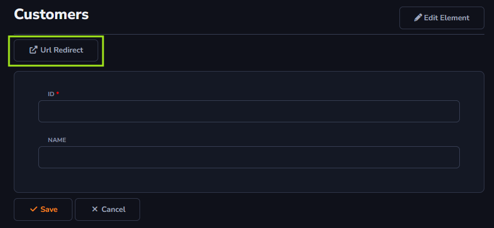

## Form Toolbar

The information below will be used to demonstrate the applicability of actions when associated with the *Form Toolbar*.

The action button will be applied within the form. For example, when trying to add an item to your table, the button will be visible in the top-left corner of the form.

