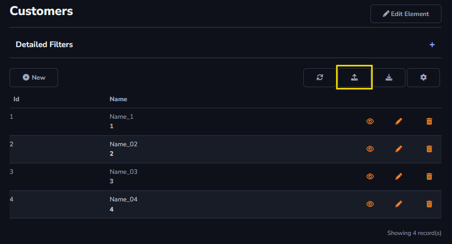
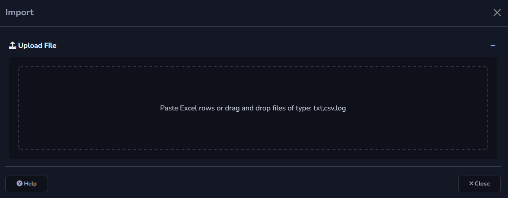
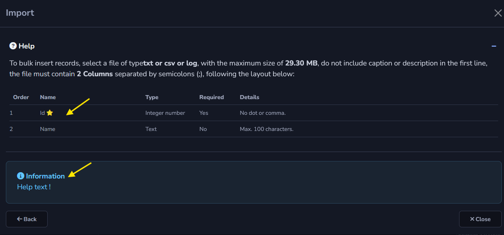

## Import Action

The Import action will allow the table to be populated through the import of an external file.

#### Tab Import Action

- SQL Command before and after starting the process: SQL command can be configured to change the value of a table column, for example, setting a TRUE value for a column if the data has already been imported.

- Global Scope: Only one process from this element can be run at a time, and all users will be able to view the latest log and execution of an ongoing process.

- User Scope: Several users can run this process simultaneously, but only see the log and one run of their process.

- Help Text: This field will be used to provide help information to the user, for example, instructions on how the file should be formatted before importing it into the system.

How it will work:

The image below shows how the upload form will be displayed. The file can be fully imported, or there is an option to copy and paste information directly into the import area.

When accessing the *HELP* field, it will be possible to view the columns available in the table and the required information that must be in the file for import; these fields will be marked with an *asterisk* beside them.

The field with the information registered in your *Help Text* will also be displayed.

#### About Grid Toolbar

The *Import* action can only be applied to the *Grid Toolbar*.

[!include[expressions](grid_toolbar_overview_action.md)]

#### About General and Advanced settings

[!include[expressions](overview_action.md)]