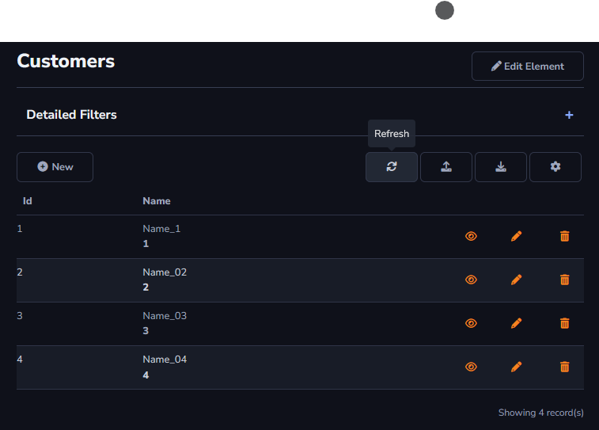

## Refresh Action

The refresh action will be used to update the data in the current table. For example, if a user initially has access only to view data but later receives permission to edit those same records, *Refresh* can update the user's access to the table data.

The *Refresh* action can be found in Actions - Grid Toolbar.

#### About Grid Toolbar

The *Refresh* action can only be applied to the *Grid Toolbar*.

[!include[expressions](grid_toolbar_overview_action.md)]

#### About General and Advanced settings

[!include[expressions](overview_action.md)]