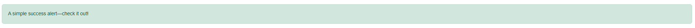
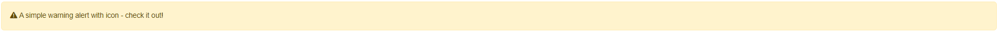
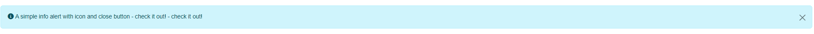

# JJ Alert

JJAlert is the component responsible for creating dynamic alerts.

## Usage

In your Controller, create a JJAlert instance and use it as a ViewBag or add it as a property to your ViewModel.

```csharp
    var alert = new JJAlert();
    alert.Messages.Add("A simple success alert—check it out!");
    alert.Color = PanelColor.Success;
    ViewBag.Alert = alert;  
```
In your view, just render the contents of GetHtml().

```csharp
    @ViewBag.Alert.GetHtmlContent()
```



## Customization

**Icons** Set the icon to be used in the Icon property to
quickly provide matching colored icons on any alert.

```csharp
    alert.Messages.Add("A simple warning alert with icon - check it out!");
    alert.Color = PanelColor.Warning;
    alert.ShowIcon = true; 
    alert.Icon = FontAwesomeIcon.ExclamationTriangle;
```



**Close Button** Set whether to display the close alert button.

```csharp
    alert.Messages.Add("A simple info alert with icon and close button - check it out! - check it out!");
    alert.Color = PanelColor.Info;
    alert.ShowIcon = true;  
    alert.Icon = FontAwesomeIcon.InfoCircle;
    alert.ShowCloseButton = true;
```



## TagHelper

JJAlert also have a TagHelper

```html
    <jj-alert
        title="Success"
        message="Connection successfully estabilished."
        icon="@FontAwesomeIcon.CheckCircle"
        color="@PanelColor.Success"/>
```

> [!TIP] 
> JJAlert does consider internationalization.


You can check all JJAlert properties at <xhref:JJMasterData.Core.UI.Components.JJAlert>
