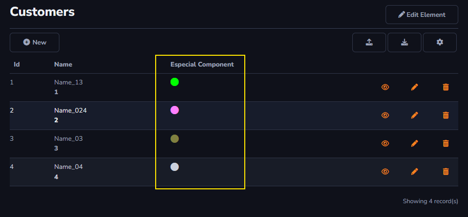

## Especial Componente

This option will be used for values in general. There will be an explanation for every option inside *Especial Component*.

To learn how to access the *Components* field : [Overview Component ](../../components/data_dictionary/overview_component.md)

#### Color

Allows you to include a color component in the table column. This component can be associated with a legend, where each color has a specific meaning.

#### Icon

Allows you to include an icon as information in your table column. Similar to the *Color Component*, icons can be associated with legends to convey their specific meanings.