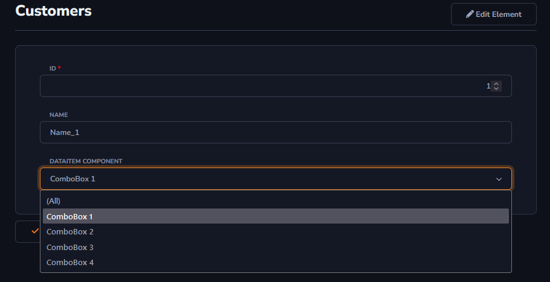
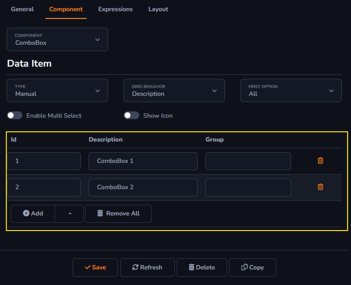
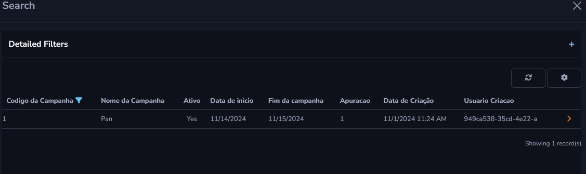
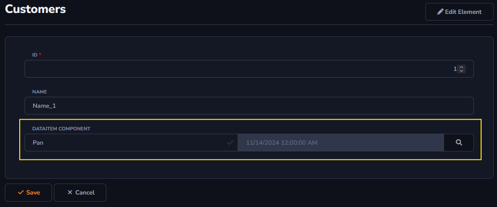
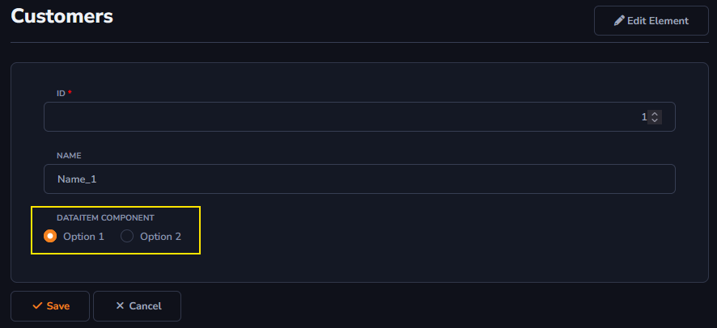
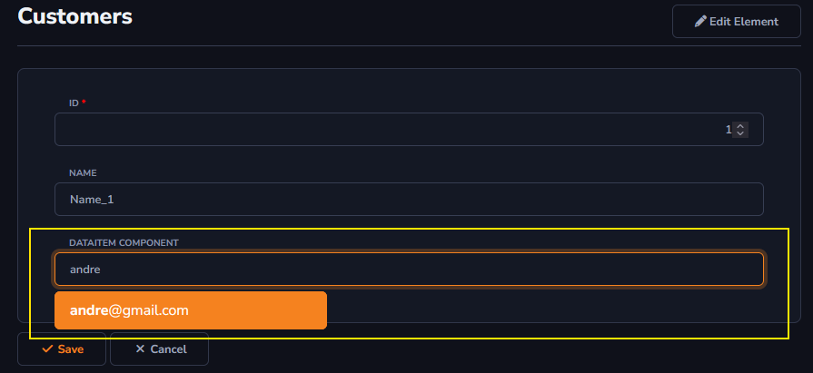

## Data Item Component

This option will be used for values in general. There will be an explanation for every option inside *Data Item Component*.

To learn how to access the *Components* field : [Overview Component ](../components/overview_component.md)

#### Combo Box

This component allows multiple options for the user to choose from. The image below shows how it works.

There is a place to include the options for your Combo Box.

#### Lookup

This component will allow information from another table to be selected for the current grid column.

When clicking on the search field:

The image below shows the **Nome da Campanha** and **Data Criação**, as they were selected during the *Lookup* component registration. It is possible to change which values are displayed. *Element Map* will be used to register the search information mentioned above. *Element Name* is used to select the existing table, and *ID* and *Description* define which information will be displayed. It is important to note that the information can be changed according to the *Type* field. More information about this field can be found at the end of the page, in *Additional Settings*.

The image below illustrates the display:

 

#### Radio Button Group

This component allows enabling a set of radio buttons that let the user select one option among them. The registered options can be configured according to the selection in the *Type* field. More information about this field can be found at the end of the page, in *Additional Settings*.

 

#### Search Box

An input field that allows the user to enter search terms to find specific information. As the user types, the component can suggest matching results to facilitate the search.

#### Additional Settings

- **Type**: Allows you to choose how the displayed information will be collected. Information can be selected through an *SQL Command*, manually entered by the creator, or selected from another existing dictionary via the *Element Map*.

- **Grid Behavior**: Allows you to choose which information from your record will be displayed in the grid column of the data dictionary.

- **First Option**: Allows you to change which option will be the first displayed in the *Combo Box*.

- **Enable Multi Select**: Allows the user to select more than one value displayed in the *Combo Box*.

- **Show Icon**: Allows an icon to be added next to the *Combo Box* options.

- **Element Map**: Allows you to register which table and which information will be displayed when adding new information to the current dictionary. Element Name is used to select an existent table. The field ID and Description can be user to set which informations will be displayed in the grid.

- **Filter**: Allows you to enable the existing filter in the table selected through the *Element Map* field.

