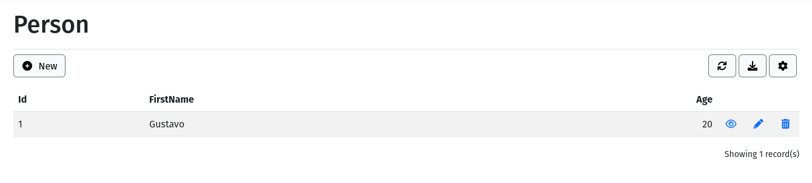

# CRUD operations

A dictionary generates a grid for finding records and a form for creating, viewing, editing, and deleting them. This guide uses the `Person` dictionary from [Create the first dictionary](../getting-started/first-dictionary.md). It explains what users can do in the generated UI and where to configure the behavior in the data dictionary.

## Before you start

Complete [Create the first dictionary](../getting-started/first-dictionary.md), or use another dictionary with a table, at least one primary-key field, and fields placed in a panel. Start the application and open the form through **Render** in the dictionary editor, or browse to:

```
/MasterData/Form/Render/Person
```

Replace `Person` with the dictionary's **Name**. The route uses the dictionary name, not necessarily the database table name. The generated form uses the connection, table mapping, fields, panels, rules, and actions saved in that dictionary.

> [!NOTE]
> The generated UI is not an authorization boundary. Ensure the host application protects the route and data source according to its authorization policy. Hiding or disabling an action only changes its UI availability.

## Understand the generated CRUD

The initial page is a grid. It displays records returned by the dictionary's entity provider and exposes commands configured for the grid. Selecting or opening a record displays the form, where the fields in its panels are rendered with their configured components.

| User task | Generated UI | Dictionary configuration that affects it |
| --- | --- | --- |
| Find records | Grid filters, ordering, and pagination | Fields, `DataItem` lookups, grid options, and grid actions |
| Create a record | **New**, then **Save** | Form toolbar actions, field required settings, rules, and insert events |
| Change a record | **Edit**, then **Save** | Row/form actions, field expressions, rules, and update events |
| Inspect without changing | **View** | Row actions, field visibility, and form layout |
| Remove a record | **Delete** | Row/form actions, primary-key fields, delete rules, and delete events |
| Exchange records | **Import** or **Export** | Grid toolbar actions, field export settings, registered formats, and background-job services |



The commands that appear are not hard-coded for every dictionary. In **Data Dictionary** > your element > **Actions**, add or configure actions in the collection that matches where the command belongs:

| Collection | Where the command appears | Typical built-in actions |
| --- | --- | --- |
| **Grid Toolbar Actions** | Above the list; can use the current selection | New, filter, refresh, import, export |
| **Grid Table Actions** | On one grid row | View, edit, delete |
| **Form Toolbar Actions** | In the open form | Save, cancel, delete |
| **Field Actions** | Beside a compatible editor | Field-specific commands |

Each action needs a unique name. Use its **Visible Expression** to hide it and **Enable Expression** to leave it visible but unavailable. See [Actions](../concepts/actions.md#configuration-reference) and [Expressions](../concepts/expressions.md) for the available settings and expression syntax.

## 1. Find and open a record

Open `/MasterData/Form/Render/Person`. Use the grid controls to filter, sort, and move between pages, then use the row action to open a record. Lookup fields display the label resolved by their `DataItem`, rather than only the stored key.

For `Person`, filter by `Name`, then open the `Ada Lovelace` record in **View** or **Edit** mode. **View** is appropriate when users should inspect the values without changing them; **Edit** enables only fields whose expressions allow editing in that form state.

If a field or an action is unexpectedly absent, first check its **Visible Expression** in the relevant state. If it is shown but cannot be used, check its **Enable Expression**. Field expressions and action expressions are evaluated independently.

## 2. Create and save a record

In the grid, click **New**. For the `Person` example:

1. Leave `Id` unchanged. Its identity column generates the value and the field's enable expression keeps it read-only.
2. Enter a value such as `Grace Hopper` for the required `Name` field.
3. Click **Save**.

Before writing to the database, the form applies field transformations and validates the field settings and applicable rules. If any validation fails, the form keeps the entered values and displays the errors; no record is written. A successful save returns to the configured result or follows a redirect supplied by an event.

> [!IMPORTANT]
> Set **Primary Key** correctly for every writable dictionary. Updates and deletes identify the target record through its key values. An identity field is not a replacement for a primary-key definition in the dictionary.

## 3. Edit and delete a record

Open a record with **Edit**, change an editable value, and click **Save**. The same validation flow runs before the update. Required fields, field types and sizes, and rules apply to the submitted values; a disabled field is not editable simply because the form is in edit mode.

To remove the record, use **Delete** from the row or form toolbar and confirm the prompt when one is configured. The operation sends the record's primary-key values to the entity provider. Rules only run during deletion when their **Run On Before Delete** setting is enabled.

Delete is a real persistence operation unless the configured repository or database implements its own soft-delete behavior. Test it with non-production data and use an action confirmation message when an extra user confirmation is appropriate.

## 4. Add validation and application behavior

Use field settings for simple data contracts: **Required**, data type, size, primary key, identity, and field expressions. Use a [validation rule](../concepts/rules.md) when a condition spans fields or requires business validation. For example, a rule can reject an amount that is zero or negative even if the browser-side UI was modified.

For code that must inspect, change, or reject submitted values, register a form event in the host application. Put rejection logic in `OnBeforeInsertAsync` or `OnBeforeUpdateAsync`; add an error there to stop the write. After-events run only after the repository operation succeeds, so they are appropriate for follow-up work and redirects, not validation. See [Form events](../developer-guide/form-events.md).

## 5. Import and export records

Add the built-in **Import** and **Export** actions to the grid toolbar when users need file-based operations. They run as background jobs, so the UI can report progress and completion separately from the original request.

For export, mark each field that may appear in a file with its **Export** setting. Export uses the current filters and ordering, but is not limited to the grid page currently visible. Registered formats determine the file types that the user can choose.

For import, use the field order and labels displayed in the import dialog. The importer maps supported visible fields by position, rather than matching arbitrary column headers. Import validation runs in import state; rules need **Run On Before Import** enabled to participate.

## 6. Enable audit history

An audit-log action makes history accessible in the UI, but it does not turn on auditing by itself. Enable `Options.EnableAuditLog` on the dictionary to record supported successful writes. The audit entry is written after the repository persists the record; a validation failure does not create an entry.

Confirm that the host's audit-log table and connection configuration are ready before enabling this option in a production dictionary. See [Hosting and configuration](../developer-guide/configuration.md) for application-level configuration.

## Troubleshooting checklist

| Symptom | Check first |
| --- | --- |
| A command is missing | The appropriate action collection and the action's **Visible Expression** |
| A command is disabled | The action's **Enable Expression** and the current form/grid state |
| A field is missing or read-only | Its panel assignment, **Visible Expression**, and **Enable Expression** |
| Save shows validation errors | Required/type/size settings, applicable rules, and before-events |
| Save fails without a field error | The server log for `DbException`, plus table mapping, connection, keys, and database permissions |
| Delete affects no record or fails | Primary-key field configuration and rules enabled for delete |
| An import/export job does not finish | Background-job registration, storage configuration, and the server log |
| Audit history is empty | `Options.EnableAuditLog`, the audit action, and audit storage configuration |

When changing a dictionary, save the metadata and use **Render** or **Preview** to retest the affected operation. Dictionary changes do not apply database schema changes automatically; review **Database Scripts** and deploy schema changes separately. For an end-to-end acceptance check, repeat the create, edit, delete, import, and export paths with a non-production dictionary.
