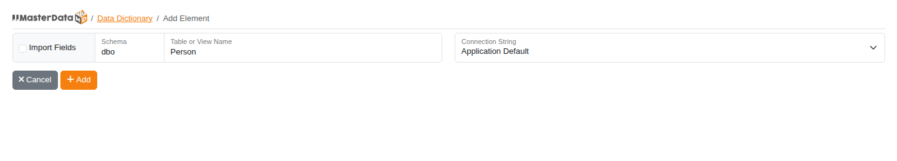
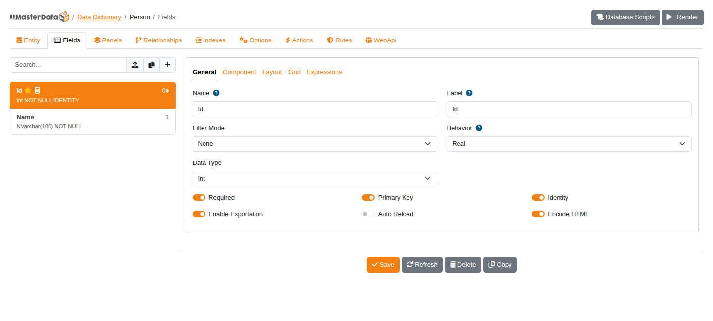
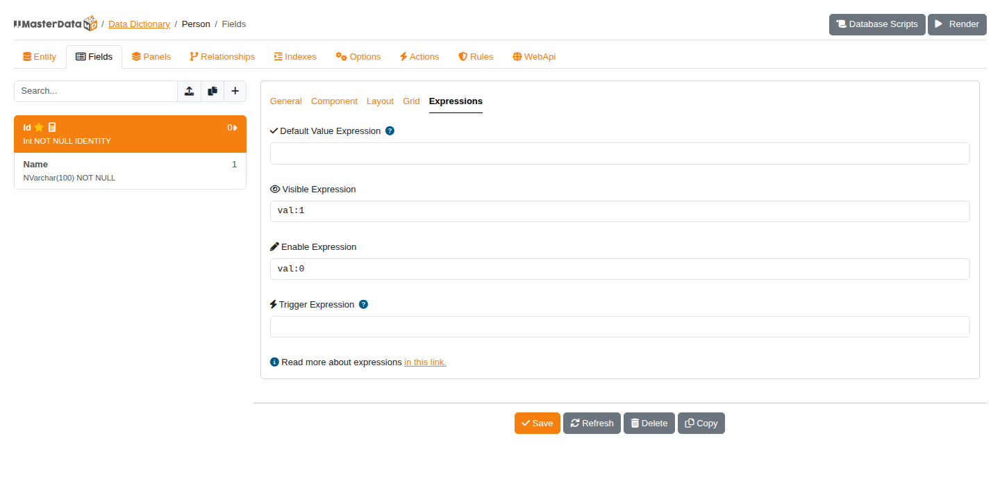
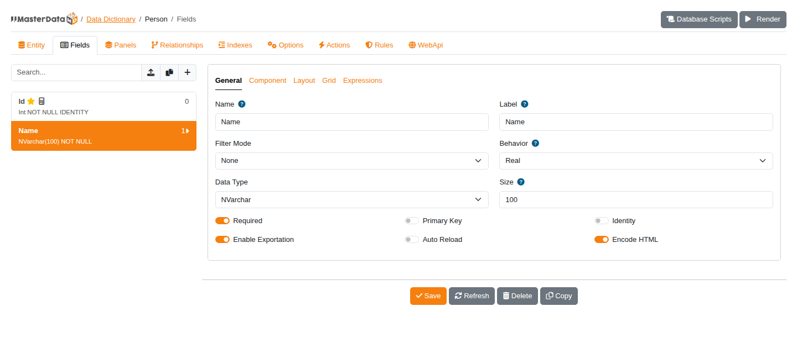
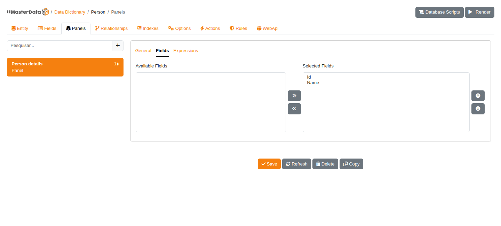
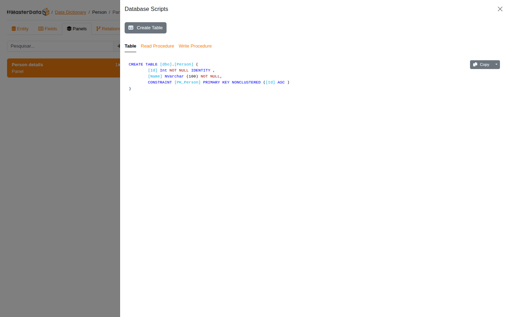
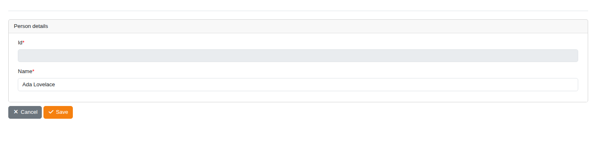
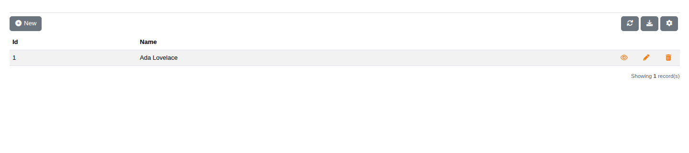

# Create the first dictionary

Create a `Person` dictionary, generate its SQL Server table, and insert a record through the generated form. This walkthrough uses the English interface and a new table with two fields: an automatically generated `Id` and a required `Name`.

## Before you start

Complete [Installation and configuration](configuration.md), start your application, and open `/DataDictionary`. Use a development database where `dbo.Person` does not already exist. The configured connection must allow saving dictionary metadata and creating the example table.

If the table already exists, use **Import Fields** when adding the element instead. Check the imported primary key, identity, sizes, and required settings against the database; skip the table-creation step below.

## 1. Add the element

Click **New** in the data dictionary list. On **Add Element**:

1. Leave **Import Fields** unchecked to define a new table manually.
2. Enter `dbo` in **Schema** and `Person` in **Table or View Name**.
3. Leave **Connection String** set to **Application Default** to use your configured connection.
4. Click **Add**.

The editor opens with tabs such as **Entity**, **Fields**, and **Panels**. In **Entity**, verify that **Name** and **Table Name** are `Person` and **Schema** is `dbo`. Leave **Read Procedure** and **Write Procedure** empty for this example; the CRUD can access the table without stored procedures.

`Name` identifies the dictionary in routes and event registrations; `Table Name` identifies the database table. They can differ. Creating the element saves metadata, but does not create the application table.

## 2. Define the fields

Open **Fields**. Use the empty editor for the first field, then the **+** button beside the search box to add the next one. Configure the **General** tab as follows:

| Setting | `Id` | `Name` |
| --- | --- | --- |
| Name | `Id` | `Name` |
| Label | `Id` | `Name` |
| Behavior | `Real` | `Real` |
| Data Type | `Int` | `NVarchar` |
| Size | Leave at `0` | `100` |
| Required | On | On |
| Primary Key | On | Off |
| Identity | On | Off |

**Primary Key**, **Identity**, and **Required** correspond to the metadata properties `IsPk`, `AutoNum`, and `IsRequired`.

### Configure Id

Enter the settings above. On the **Component** tab, choose **Number**. Click **Save** to save the field.

Open the field's **Expressions** tab and set **Enable Expression** to `val:0`, then click **Save** again. This makes the identifier non-editable in the form so SQL Server can generate it. Keep **Visible Expression** at `val:1`.

> [!IMPORTANT]
> Do not skip the enable expression. With the field enabled and required, the form asks for an `Id` value even when **Identity** is on.

### Configure Name

Click **+**, enter the `Name` settings from the table, and keep **Component** set to **TextBox**. Click **Save**. Both fields should now appear in the list on the left.

## 3. Place the fields in a panel

Open **Panels** and use the empty editor to create a panel:

1. In **General**, set **Layout** to **Panel** and **Title** to `Person details`.
2. Open the panel's **Fields** tab.
3. Select `Id` and `Name` under **Available Fields** and click the right-arrow button to move them to **Selected Fields**. You can move them individually or use Ctrl-click to select both.
4. Click **Save**.

Return to the panel's **Fields** tab to verify that both fields are selected. This assigns the fields to the panel through their `PanelId`; you do not need to enter the ID manually.

## 4. Create the database table

Click **Database Scripts** at the top of the editor. Review the **Table** script: it should create `[dbo].[Person]` with an identity `Int` primary key and a required `NVarchar(100)` name.

Click **Create Table** to execute the generated script in the dictionary's configured database. Close the drawer when execution finishes.

This example leaves stored procedures unconfigured. If you configure **Read Procedure** or **Write Procedure** in **Entity**, review their script tabs too; the creation action changes to include the configured procedures. You can also use **Copy** to review and run scripts with your database tooling.

Saving dictionary metadata alone does not apply schema changes to the database. For an existing table, review any proposed changes against its current structure instead of trying to create it again.

## 5. Insert the first record

Click **Render**, or open `/MasterData/Form/Render/Person`. The generated grid initially has no records.

1. Click **New**.
2. Leave `Id` unchanged; SQL Server generates it.
3. Enter `Ada Lovelace` in **Name**.
4. Click **Save**.

The grid should show the saved name and its generated identifier (`1` in a fresh table). Reload the page to confirm that the record was persisted.

You now have a dictionary, a matching database table, and a working generated form. Continue with [CRUD operations](../user-guide/crud-operations.md) to explore the available record actions.
