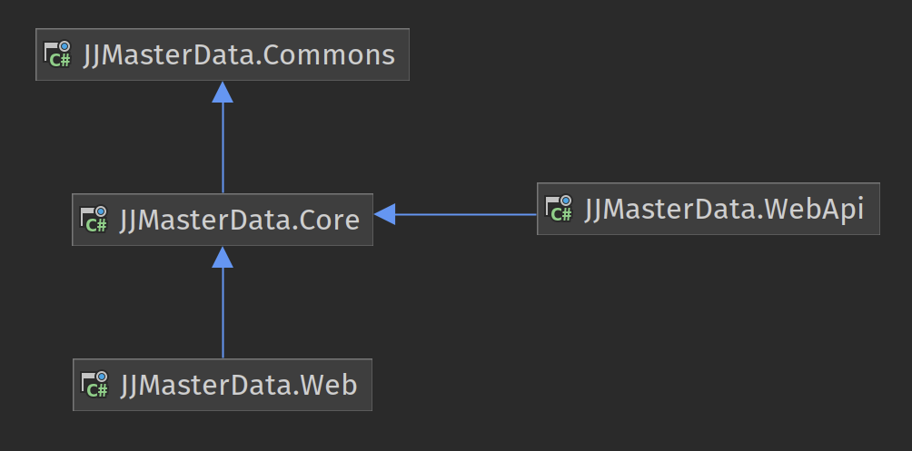

# Assemblies

JJMasterData dependency tree can be represented by the following diagram:

## Assemblies

### JJMasterData.Web 
Target Framework: .NET 10
 
Razor Class Library with web graphical interfaces to manipulate and render your metadata.

### JJMasterData.WebApi
Target Framework: .NET 10
 
Restful API to consume your metadata at any front-end.

### JJMasterData.Core
Target Framework: .NET 10
 
Library to access your metadata from .NET and/or render it at HTML components.

### JJMasterData.Commons
Target Framework: .NET 10
 
Utilities to all assemblies, like database access, l10n, logging and utils.
